# Linux6.1.33\_User’s Manual\_V1.0

Document classification: □ Top secret □ Secret □ Internal information ■ Open

## Copyright

The copyright of this manual belongs to Baoding Folinx Embedded Technology Co., Ltd. Without the written permission of our company, no organizations or individuals have the right to copy, distribute, or reproduce any part of this manual in any form, and violators will be held legally responsible.

Forlinx adheres to copyrights of all graphics and texts used in all publications in original or license-free forms.

The drivers and utilities used for the components are subject to the copyrights of the respective manufacturers. The license conditions of the respective manufacturer are to be adhered to. Related license expenses for the operating system and applications should be calculated/declared separately by the related party or its representatives.

## Application Scope

This manual is mainly applicable to the Linux6.1.33 operating system on the Forlinx OK6254\&OK6232\&OK6231 platform. Other platforms can also refer to it, but there will be differences between different platforms. Please make modifications according to the actual conditions.

## Revision History

| Date       | User Manual Version | Revision History |
| ---------- | ------------------- | ---------------- |
| 11/06/2024 | V1.0                | Initial Version  |

## Overview

This manual is designed to help you quickly familiarize yourselves with the product, and understand the interface functions and testing methods. It primarily covers the testing of interface functions on the development board, the methods for flashing images, and troubleshooting procedures for common issues encountered in use. In the process of testing, some commands are annotated to facilitate your understanding, mainly for practical use.

There are total six chapters:

+ Chapter 1. provides an overview of the product, briefly introducing the interface resources of the development board, the relevant driver paths in the kernel source code, supported flashing and booting methods, as well as explanations of key sections in the documentation;
+ Chapter 2. is the fast boot/startup of the product, which can adopt two ways of serial port login and network login;
+ Chapter 3. is the command line operation of the product for functional testing.
+ Chapter 4. is QT interface function test of the product;
+ Chapter 5. is the multimedia test of the product, including the playback test of the camera and the video hardware codec test;
+ Chapter 6. is the image update of the product, which mainly describes the method of updating the image to the storage device. Users can choose the corresponding flashing mode according to the actual situation.

## 1. OK62xx Development Board Description

The FET6254/6232/6231-C SoM is designed and developed based on TI AM6254/6232/6231 high-performance and low-power processors, and supports Cortex-A53 + Cortex-M4F + R5FSS core processors. It runs at up to 1.4GHz (the AM6231 runs at 1Ghz). 

The interface diagram of OK62xx-C development board is as follows:

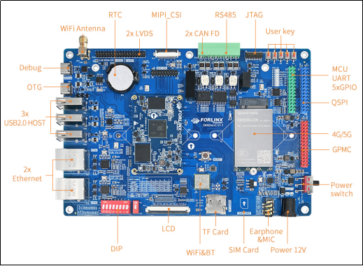

**Note: The hardware parameters are not described in this software manual. Please read "OK62xx-C \_ Hardware Manual" under "Hardware Data/User Manual" (the download method is the same as software) before referring to this manual for software development. To understand the product naming rules and the hardware configuration information of the product, which will help you use the product.**

### 1.1 Introduction to Linux 6.1.33 System Software Resources

|      **<font style="color:rgb(0,0,0);">Device</font>**       | **<font style="color:rgb(0,0,0);">Location of driver source code in the kernel</font>** | **<font style="color:rgb(0,0,0);">Device Name</font>**       |
| :----------------------------------------------------------: | ------------------------------------------------------------ | ------------------------------------------------------------ |
| <font style="color:rgb(0,0,0);">LCD </font><font style="color:rgb(0,0,0);">Backlight Driver</font> | <font style="color:rgb(0,0,0);">drivers/video/backlight/</font><font style="color:rgb(0,0,0);">pwm\_bl.c</font> | <font style="color:rgb(0,0,0);">/sys/class/backlight</font>  |
|                 USB Interface USB flash disk                 | <font style="color:rgb(0,0,0);">drivers/</font><font style="color:rgb(0,0,0);">usb</font><font style="color:rgb(0,0,0);">/storage/</font> |                                                              |
| <font style="color:rgb(0,0,0);">USB</font><font style="color:rgb(0,0,0);">Mouse</font> | <font style="color:rgb(0,0,0);">drivers/hid/</font><font style="color:rgb(0,0,0);">usbhid</font><font style="color:rgb(0,0,0);">/</font> | <font style="color:rgb(0,0,0);">/dev/input/</font><font style="color:rgb(0,0,0);">eventX</font> |
|                           Ethernet                           | <font style="color:rgb(0,0,0);">drivers/net/ethernet/</font><font style="color:rgb(0,0,0);">ti</font><font style="color:rgb(0,0,0);">/am65-cpsw-nuss.c</font> |                                                              |
| <font style="color:rgb(0,0,0);">TF card</font><font style="color:rgb(0,0,0);">card driver</font> | <font style="color:rgb(0,0,0);">drivers/mmc/host/sdhci\_am654.c</font> | <font style="color:rgb(0,0,0);">/dev/block/mmcblk1pX</font>  |
| <font style="color:rgb(0,0,0);">EMMC</font><font style="color:rgb(0,0,0);">driver</font> | <font style="color:rgb(0,0,0);">drivers/mmc/host/sdhci\_am654.c</font> | <font style="color:rgb(0,0,0);">/dev/block/mmcblk0pX</font>  |
|                             RTC                              | <font style="color:rgb(0,0,0);">drivers/</font><font style="color:rgb(0,0,0);">rtc</font><font style="color:rgb(0,0,0);">/rtc-pcf8563.c</font> | <font style="color:rgb(0,0,0);">/dev/rtc0</font>             |
|      <font style="color:rgb(0,0,0);">Serial port</font>      | <font style="color:rgb(0,0,0);">drivers/</font><font style="color:rgb(0,0,0);">tty</font><font style="color:rgb(0,0,0);">/serial/8250/8250\_omap.c</font> | <font style="color:rgb(0,0,0);">/dev/</font><font style="color:rgb(0,0,0);">ttySX</font> |
|                             LED                              | <font style="color:rgb(0,0,0);">drivers/</font><font style="color:rgb(0,0,0);">leds</font><font style="color:rgb(0,0,0);">/</font><font style="color:rgb(0,0,0);">leds-gpio.c</font> |                                                              |
|                         Audio driver                         | <font style="color:rgb(0,0,0);">sound/soc/codecs/es8328-i2c.c</font> | <font style="color:rgb(0,0,0);">/dev/</font><font style="color:rgb(0,0,0);">snd</font><font style="color:rgb(0,0,0);">/</font> |
|                           Watchdog                           | <font style="color:rgb(0,0,0);">drivers/watchdog/</font><font style="color:rgb(0,0,0);">rti\_wdt.c</font> |                                                              |
|          <font style="color:rgb(0,0,0);">SPI</font>          | <font style="color:rgb(0,0,0);">drivers/</font><font style="color:rgb(0,0,0);">spi</font><font style="color:rgb(0,0,0);">/spi-omap2-mcspi.c</font> |                                                              |
|         <font style="color:rgb(0,0,0);">OSPI</font>          | <font style="color:rgb(0,0,0);">drivers/</font><font style="color:rgb(0,0,0);">spi</font><font style="color:rgb(0,0,0);">/</font><font style="color:rgb(0,0,0);">spi</font><font style="color:rgb(0,0,0);">-cadence-</font><font style="color:rgb(0,0,0);">quadspi.c</font> |                                                              |
| <font style="color:rgb(0,0,0);">SPI(</font><font style="color:rgb(0,0,0);">spidev</font><font style="color:rgb(0,0,0);">)</font> | <font style="color:rgb(0,0,0);">drivers/</font><font style="color:rgb(0,0,0);">spi</font><font style="color:rgb(0,0,0);">/</font><font style="color:rgb(0,0,0);">spidev.c</font> |                                                              |
|     <font style="color:rgb(0,0,0);">SPI Nor Flash</font>     | <font style="color:rgb(0,0,0);">drivers/</font><font style="color:rgb(0,0,0);">mtd</font><font style="color:rgb(0,0,0);">/</font><font style="color:rgb(0,0,0);">spi</font><font style="color:rgb(0,0,0);">-nor/</font><font style="color:rgb(0,0,0);">core.c</font> | <font style="color:rgb(0,0,0);">/dev/</font><font style="color:rgb(0,0,0);">mtdx</font> |
|          <font style="color:rgb(0,0,0);">PWM</font>          | <font style="color:rgb(0,0,0);">drivers/</font><font style="color:rgb(0,0,0);">pwm</font><font style="color:rgb(0,0,0);">/</font><font style="color:rgb(0,0,0);">pwm-tiehrpwm.c</font> |                                                              |
| <font style="color:rgb(0,0,0);">OV</font><font style="color:rgb(0,0,0);">5645</font> | <font style="color:rgb(0,0,0);">D</font><font style="color:rgb(0,0,0);">rivers</font><font style="color:rgb(0,0,0);">/media/i2c/ov5645.c</font> | <font style="color:rgb(0,0,0);">/dev/</font><font style="color:rgb(0,0,0);">video0</font> |
| <font style="color:rgb(0,0,0);">Can</font><font style="color:rgb(0,0,0);">driver</font> | <font style="color:rgb(0,0,0);">drivers/net/can/can/</font><font style="color:rgb(0,0,0);">m\_can</font> |                                                              |
|                       Bluetooth driver                       | <font style="color:rgb(0,0,0);">drivers/</font><font style="color:rgb(0,0,0);">bluetooth</font><font style="color:rgb(0,0,0);">/\*</font> |                                                              |
| <font style="color:rgb(0,0,0);">WIFI</font><font style="color:rgb(0,0,0);">driver</font> | <font style="color:rgb(0,0,0);">drivers/net/wireless/</font><font style="color:rgb(0,0,0);">azurewave\_wlan</font><font style="color:rgb(0,0,0);">/\*</font> |                                                              |
| <font style="color:rgb(0,0,0);">4G</font><font style="color:rgb(0,0,0);">driver</font> | <font style="color:rgb(0,0,0);">drivers/net/</font><font style="color:rgb(0,0,0);">usb</font><font style="color:rgb(0,0,0);">/</font><font style="color:rgb(0,0,0);">GobiNet</font><font style="color:rgb(0,0,0);">\*</font> |                                                              |
| <font style="color:rgb(0,0,0);">I2C</font><font style="color:rgb(0,0,0);">driver</font> | <font style="color:rgb(0,0,0);">drivers/i2c/busses/i2c-omap.c</font> |                                                              |
| <font style="color:rgb(0,0,0);">GT911</font><font style="color:rgb(0,0,0);">touch driver</font> | <font style="color:rgb(0,0,0);">drivers/input/touchscreen/</font><font style="color:rgb(0,0,0);">goodix.c</font> | <font style="color:rgb(0,0,0);">/dev/input/</font><font style="color:rgb(0,0,0);">eventX</font> |
| <font style="color:rgb(0,0,0);">Gt928</font><font style="color:rgb(0,0,0);">touch driver</font> | <font style="color:rgb(0,0,0);">drivers/input/touchscreen/</font><font style="color:rgb(0,0,0);">goodix.c</font> | <font style="color:rgb(0,0,0);">/dev/input/</font><font style="color:rgb(0,0,0);">eventX</font> |
|                     TSC2007 touch driver                     | <font style="color:rgb(0,0,0);">drivers/input/touchscreen/</font><font style="color:rgb(0,0,0);">tsc</font><font style="color:rgb(0,0,0);">2007.</font><font style="color:rgb(0,0,0);">c</font> | <font style="color:rgb(0,0,0);">/dev/input/</font><font style="color:rgb(0,0,0);">eventX</font> |

#### 1.1.1 Common Device Tree Path

|                       **Device tree**                        | **path**                                                     |
| :----------------------------------------------------------: | ------------------------------------------------------------ |
|   <font style="color:rgb(0,0,0);">Main Device Tree</font>    | arch/arm64/boot/dts/ti/OK62xx.dtsi                           |
| <font style="color:rgb(0,0,0);">Single-channel lvds device tree</font> | arch/arm64/boot/dts/ti/OK6231-C-lvds.dtso<br/>arch/arm64/boot/dts/ti/OK6232-C-lvds.dtso<br/>arch/arm64/boot/dts/ti/OK6254-C-lvds.dtso |
| <font style="color:rgb(0,0,0);">Dual-channel LVDS device tree</font> | arch/arm64/boot/dts/ti/OK6231-C-lvds-dual.dtso<br/>arch/arm64/boot/dts/ti/OK6232-C-lvds-dual.dtso<br/>arch/arm64/boot/dts/ti/OK6254-C-lvds-dual.dtso |
|    <font style="color:rgb(0,0,0);">Lcd device tree</font>    | arch/arm64/boot/dts/ti/OK6231-C-rgb.dtso<br/>arch/arm64/boot/dts/ti/OK6232-C-rgb.dtso<br/>arch/arm64/boot/dts/ti/OK6254-C-rgb.dtso |

### 1.2 Flashing and Boot Settings

<font style="color:rgb(0,0,0);">OK62XX-C currently supports eMMC, TF, USB Disk and USB DFU programming modes, but does not support QSPI mode. It supports eMMC startup, and the startup dialing code is as follows:</font>

| DIP Switch                                            | **<font style="color:rgb(0,0,0);">1</font>**  | **<font style="color:rgb(0,0,0);">2</font>**  | **<font style="color:rgb(0,0,0);">3</font>** | **<font style="color:rgb(0,0,0);">4</font>**  | **<font style="color:rgb(0,0,0);">5</font>** | **<font style="color:rgb(0,0,0);">6</font>**  | **<font style="color:rgb(0,0,0);">7</font>**  |
| ----------------------------------------------------- | :-------------------------------------------- | :-------------------------------------------- | :------------------------------------------- | :-------------------------------------------- | :------------------------------------------- | :-------------------------------------------- | :-------------------------------------------- |
| **<font style="color:rgb(0,0,0);">EMMC</font>**       | <font style="color:rgb(0,0,0);">OFF</font>    | <font style="color:rgb(0,0,0);">OFF</font>    | <font style="color:rgb(0,0,0);">OFF</font>   | <font style="color:rgb(0,0,0);">OFF</font>    | <font style="color:rgb(0,0,0);">OFF</font>   | <font style="color:rgb(0,0,0);">OFF</font>    | <font style="color:rgb(0,0,0);">OFF</font>    |
| **<font style="color:rgb(0,0,0);">TF Card</font>**    | <font style="color:rgb(0,0,0);">OFF</font>    | <font style="color:rgb(0,0,0);">OFF</font>    | <font style="color:rgb(0,0,0);">OFF</font>   | <font style="color:rgb(0,0,0);">OFF</font>    | <font style="color:rgb(0,0,0);">OFF</font>   | <font style="color:rgb(0,0,0);">OFF</font>    | **<font style="color:rgb(0,0,0);">ON</font>** |
| **<font style="color:rgb(0,0,0);">QSPI Flash</font>** | **<font style="color:rgb(0,0,0);">ON</font>** | **<font style="color:rgb(0,0,0);">ON</font>** | <font style="color:rgb(0,0,0);">OFF</font>   | **<font style="color:rgb(0,0,0);">ON</font>** | <font style="color:rgb(0,0,0);">OFF</font>   | **<font style="color:rgb(0,0,0);">ON</font>** | <font style="color:rgb(0,0,0);">OFF</font>    |
| **<font style="color:rgb(0,0,0);">USB Disk</font>**   | <font style="color:rgb(0,0,0);">OFF</font>    | **<font style="color:rgb(0,0,0);">ON</font>** | <font style="color:rgb(0,0,0);">OFF</font>   | <font style="color:rgb(0,0,0);">OFF</font>    | <font style="color:rgb(0,0,0);">OFF</font>   | **<font style="color:rgb(0,0,0);">ON</font>** | <font style="color:rgb(0,0,0);">OFF</font>    |
| **<font style="color:rgb(0,0,0);">USB DFU</font>**    | <font style="color:rgb(0,0,0);">OFF</font>    | **<font style="color:rgb(0,0,0);">ON</font>** | <font style="color:rgb(0,0,0);">OFF</font>   | <font style="color:rgb(0,0,0);">OFF</font>    | <font style="color:rgb(0,0,0);">OFF</font>   | <font style="color:rgb(0,0,0);">OFF</font>    | <font style="color:rgb(0,0,0);">OFF</font>    |

Please refer to the "6. Development Board System Flashing" for the specific programming operation process.

## 2. Preparation Before Startup

The OK62xx-C development board has two system login methods, serial and network login. 

Hardware preparation before system startup:

<font style="color:rgb(0,0,0);">12V 3A DC power cable</font>

<font style="color:rgb(0,0,0);">Network cable (for network login)</font>

<font style="color:rgb(0,0,0);">Check the DIP switch of boot mode.</font>

<font style="color:rgb(0,0,0);">Please check the red DIP switch on your development board and ensure it is switched to the desired startup mode. For instructions on how to set the startup mode, please refer to the documentation provided.</font>

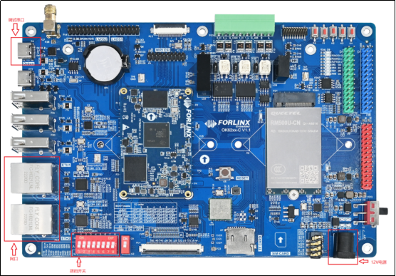

### 2.1 Hyper Terminal Settings

#### 2.1.1 Serial Port Login Description:

Serial port settings: Baud rate 115200, data bit 8, stop bit 1, no parity bit, no flow control.

The serial terminal login uses the root user with no password. If you need to change the password, refer to the relevant method of the application note.

Software: Windows PC requires Super Terminal; choose a familiar serial terminal software.

Here is an example using Putty to explain how to configure the terminal:

**Step 1:** Connect the development board and PC using a serial port cable, confirm the serial port number connected to the computer, and view the serial port number from the "Device Manager", based on the actual recognized port number of the computer.


**Step 2:** Open and set up putty, then set the“ serial line according to the COM port of the computer used, baud rate 115200;

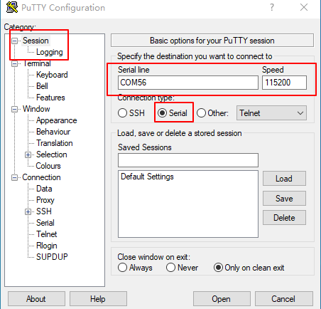

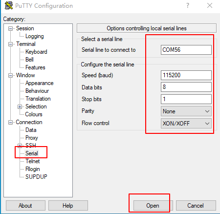

**Step 3:** The login account name is root, and no password. Click “Enter”.

```plain
_____                    _____           _         _   
|  _  |___ ___ ___ ___   |  _  |___ ___  |_|___ ___| |_ 
|     |  _| .'| . | . |  |   __|  _| . | | | -_|  _|  _|
|__|__|_| |__,|_  |___|  |__|  |_| |___|_| |___|___|_|  
|___|                    |___|            
Arago Project OK62xx -

Arago 2023.04 OK62xx -
OK62xx login: root
```

**Step 4:** View the kernel version information.

```plain
root@OK62xx:~#cat  /proc/version
Linux version 6.1.33-g0ea564278f1c (aarch64-none-linux-gnu-gcc (Arm GNU Toolchain
11.3.Rel1) 11.3.1 20220712, GNU ld (Arm GNU Toolchain 11.3.Rel1) 2.38.20220708) #1 SMP
PREEMPT Mon Oct  9 11:11:30 UTC 2023
```

From the printed information, you can see the SoM is flashed with linux 6.1. 33 related images.

Kernel version information can also be viewed with the uname -a command:

```plain
root@OK62xx:~#uname -a
Linux OK62xx 6.1.33-g0ea564278f1c #1 SMP PREEMPT Mon Oct  9 11:11:30 UTC 2023 aarch64 aarch64 aarch64 GNU/Linux
```

#### **2.1.2 Common Serial Port Issues**

Common problem troubleshooting points for logging in using the serial port are as follows:

**Case 1:** No information is printed after connecting to the serial port:

1\. First check that the dip switches are correct;

2\. Reopen the serial port;

3\. Test it with a different serial cable;

4\. If all of the above still does not work, check the status of the SoM LEDs. If it is always on, the system may not be able to start, then the system needs to be re-flashed.

**Case 2:** Unable to input commands after connecting to the serial port.

1\. Reopen the serial port;

2\. Replace the USB serial port cable with a new USB port on the computer, view the corresponding COM port in the device management, and reopen the serial port;

3\. Replace the serial cable with a new one.

### **2.2 Network Login Methods**

OK62xx supports SSH network login and FTP file transfer in addition to debugging serial port login. The following is an example of the use of network tools with the development board IP of **192.168.1.50**.

#### 2.2.1 SSH

The OK62xx development board supports SSH service and it is automatically enabled at startup, so it can be used as an SSH server after setting the IP address. You can log in to the development board via SSH for development and debugging, as well as use scp for file transfer.

On a Linux system, enter the following command:

```plain
C:\Users\89412>ssh root@192.168.1.50
```


When logging in for the first time, you need to enter yes to confirm the connection according to the prompt, and when exiting, enter exit.

For example, to copy the current directory image to the root directory of the development board, enter the following command:

```plain
C:\Users\89412>scp d:\Image root@192.168.1.50:/
```

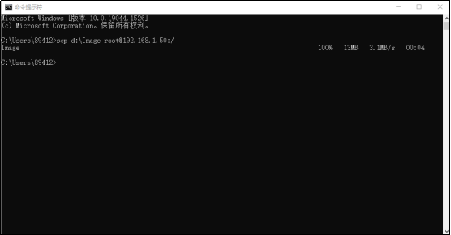

**Note: If SSH is not supported on your PC, please install it yourself.**

If an error is reported as shown below:


This situation means that you have used SSH to log in to other boards before, so when you log in to the board of another platform, the above error will be reported, the solution is to enter the following two commands:

```plain
C:\Users\Administrator>cd .ssh
C:\Users\Administrator\.ssh>del  known_hosts
```

Just re-enter the ssh command to log in after completing the above.

#### 2.2.2 FTP

The OK62 development board supports FTP service and it is automatically enabled at startup, so it can be used as an FTP server after setting the IP address. The following describes how to utilize the FTP tool for file transfer.

Path: OK62xx (Linux) user profile\\tool\\FileZilla\*

Install FileZilla tool on Windows and follow the steps shown in the image below to set it up. Log in with the username root, and leave the password blank when logging in as root

**Note: If the root login fails, please check whether there is a directory named root under the /home directory. If not, you need to create it.**

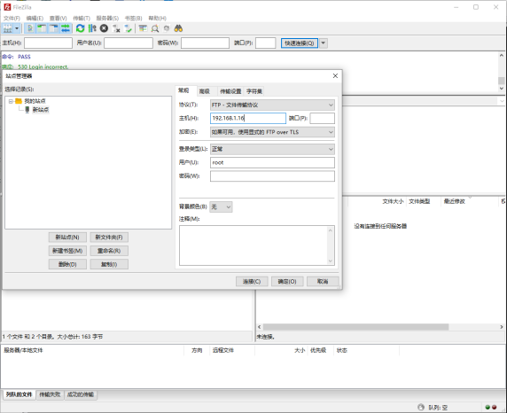

After successful login, you can upload and download.


### **2.3 EMMC System Partition Table**

The following table is the eMMC memory partition information of Linux operating system:

| Name      | **<font style="color:rgb(0,0,0);background-color:rgb(217,217,217);">Offset</font>** | **<font style="color:rgb(0,0,0);background-color:rgb(217,217,217);">Size</font>** | **<font style="color:rgb(0,0,0);background-color:rgb(217,217,217);">File System</font>** | **<font style="color:rgb(0,0,0);background-color:rgb(217,217,217);">Content</font>** |
| :-------- | :----------------------------------------------------------- | :----------------------------------------------------------- | :----------------------------------------------------------- | ------------------------------------------------------------ |
| mmcblk0p1 | 2048                                                         | 83.2M                                                        | FAT32                                                        | Store A53 R5 uboot                                           |
| mmcblk0p2 | <font style="color:rgb(0,0,0);">172416</font>                | 7.2G                                                         | Ext4                                                         | File System                                                  |

Use the df command to view disk usage on a system. df -m displays file system disk space usage in MB. The following image depicts the default disk usage of a factory-installed system （using the qt file system). Please note that the information provided is for reference only, and actual parameters may vary.

```plain
root@ok62xx:~# df -m
Filesystem     1M-blocks  Used Available Use% Mounted on
/dev/root           6819  5429      1017  85% /
devtmpfs             898     1       898   1% /dev
tmpfs                963     0       963   0% /dev/shm
tmpfs                385    10       376   3% /run
tmpfs                  4     0         4   0% /sys/fs/cgroup
tmpfs                963     1       963   1% /tmp
tmpfs                 16     0        16   0% /media/ram
tmpfs                 50     1        50   1% /var/volatile
/dev/mmcblk0p1        84     3        81   3% /run/media/Boot-mmcblk0p1
tmpfs                193     0       193   0% /run/user/0
```

Using the free command to check memory usage. The following image illustrates the memory usage without any external devices connected. Please note that this is for reference only, and actual parameters may vary.

The 2G version is as follows:

```plain
root@ok62xx:~#free
total        used        free      shared  buff/cache   available
Mem:         1970536      131616     1633564        9924      205356     1758412
Swap:              0           0           0
```

The 1G version is as follows:

```plain
root@OK62xx:~# free
total        used        free      shared  buff/cache   available
Mem:          951152      113124      587368        9904      250660      757732
Swap:              0           0           0
```

### 2.4 System Shutdown

In general, the power can be turned off directly, if there is data storage, function use and other operations, do not arbitrarily disconnect the power during the operation, in order to prevent irreversible damage to the file, you can only re-burn the firmware. To ensure the data is completely written, enter the sync command to synchronize the data before turning off the power.

The command ‘reboot’ can be used to restart the development board. You can also restart the hardware by pressing the RESET key or directly power off and restart.

**Note: For products designed based on the SoM, if there are scenarios where accidental power loss causes the system to shut down unexpectedly, measures such as adding power-loss protection can be incorporated into the design.**

### **2.5 Screen Switching**

OK62 supports LVDS, RGB and other screen interfaces. Currently, there are three methods for screen switching control: specified by the kernel device tree, dynamically controlled via the U-Boot menu, and through the QT interface UbootMenu application.

At present, OK62xx supports LVDS 1280x800, LCD 7 1024x600, LCD 7 800x480 capacitive screen and LCD 7 800x480 resistive screen.

Note: The factory default screen is LCD7 1024x600, and OK 6231 and OK 6232 do not support simultaneous display at present.

#### **2.5.1 Dynamic Control of Uboot Menu**

The solution is based on the existing screen support system and does not require recompilation of code or flashing to achieve the screen switching function.

##### **2.5.1.1 Introduction to Menus and Screen Switching Methods**

During the Uboot boot process, pressing the spacebar will enter the uboot menu.

There are three options in the menu: Enter 0 to enter the uboot command line; Enter1 to restart uboot; Enter 2 to enter the display configuration menu.

```plain
---------------------------------------------
0: Exit to console
1: Reboot
2: Display type
---------------------------------------------
Select
```

The screen configuration menu has three options: enter 0 to return to the previous menu; enter 1 to switch the display of option 1 for LVDS screen configuration; enter 2 to switch the display of option 2 for LCD screen configuration;

```plain
---------------------------------------------
select display panel type
0: Exit
1: primary display lvds off
2: secondary display rgb lcd 1024x600
---------------------------------------------
```

Screen 1 supports single lvds, dual lvds and lvdsoff; Screen 2 supports resolution 1024\**600 lcd screen, 800*\*480 lcd screen and rgb off.

```plain
---------------------------------------------
select display panel type
0: Exit
1: primary display lvds single channel duplicate
2: secondary display rgb lcd 800x480
---------------------------------------------
```

After selecting the desired configuration, enter 0 to return to the previous menu. Rebooting uboot, or going to the command line and booting the system will make the screen settings take effect.

The single LVDS mode is a duplicate mode where both single channels have outputs with the same content.

Dual LVDS for splicing larger resolution screens via dual parity division.

For other resolution screens, please modify the kernel device tree screen parameters according to the requirements of the screen parameters.

#### **2.5.2 Kernel Device Tree Specification**

Path:

OK6254: OK6254-linux-sdk/OK62xx-linux-kernel/arch/arm64/boot/dts/ti/OK6254-C.dts

OK6232: OK6254-linux-sdk/OK62xx-linux-kernel/arch/arm64/boot/dts/ti/OK6232-C.dts

OK6231: OK6254-linux-sdk/OK62xx-linux-kernel/arch/arm64/boot/dts/ti/OK6231-C.dts

This method can set the system default screen display to the desired way without connecting the serial terminal selection, which is suitable for mass production. However, we need to manually modify the device tree and regenerate the system image once again This method has higher priority than the U-boot menu dynamic control.

In the kernel source code, open the corresponding device tree, such as the OK6254-C. dts file, and find the following node:

| **Parameter**                                    | **<font style="color:rgb(0,0,0);">Meaning</font>**           |
| ------------------------------------------------ | ------------------------------------------------------------ |
| <font style="color:rgb(0,0,0);">status</font>    | Describe the node state: disabled is for off, okay is for on |
| <font style="color:rgb(0,0,0);">video-vp0</font> | Describe the lvds interface to use a single or dual screen or disable the |
| <font style="color:rgb(0,0,0);">video-vp1</font> | Describe the rgb interface to use resolution or disable it   |


Settings can be changed as needed, and after saving, recompilation is required to generate the image.

As described in the comment of this node:

video-vp0 can only write "lvds”, "lvds-dual", "disabled" to indicate single LVDS copy mode respectively, dual LVDS mode, and disabled mode, respectively (All other values are considered disabled). The screen type adapts to the Forlinx screen.

For the parameter "video-vp1", only the values "rgb", "rgb800x480", and "disabled" can be set, representing an RGB 1024x600 resolution screen, an RGB 800x480 resolution screen, and disabling (the function), respectively.

(Any other values will be treated as "disabled".)  Forlinx screen.

Other self-selected screens require modification of the panel node in OK6254-C-lvds.dts or OK6254-C-rgb.dts corresponding to lvds or rgb according to the timing parameters.

For example, the dual LVDS and RGB800x480 screens are turned on at the same time, and the reference settings are as follows:

```plain
forlinx_control {
	status = “okay”;
	video-vp0 = “lvds-dual”;
	video-vp1 = “rgb800x480”;
};
```

### **2.6 Resistor Touchscreen Recalibration**

Refer to the application note for the OK6232 and OK6231 calibration methods. When using a resistive touch screen on the OK6254, if recalibration is required, please follow these steps:

1\. Add the following command to enable calibration;

2\. Save the changes;

3\. Restart the development board.

```plain
root@ok62xx:/# vi /etc/xdg/weston/weston.ini
```

**Note: Before calibration, ensure that LVDS is turned off in the uboot resolution menu and only the LCD with a resolution of 800x480 is enabled.**

When using the Forlinx V1.2 carrier board, it is necessary to ensure that the power - off time is 2 seconds before each power - on. Otherwise, the touch function of the resistive screen may fail.

```plain
root@ok62xx:/# weston-touch-calibrator "DPI-1" --debug -v
Configure calibrator window to size 800x480
Down[0] (0.809250, 0.149500)
Finish[0]
Conv[0] (0.150000, 0.100000)
Down[1] (0.801250, 0.846750)
Finish[1]
Conv[1] (0.850000, 0.129167)
Down[2] (0.223750, 0.210250)
Finish[2]
Conv[2] (0.200000, 0.800000)
Down[3] (0.251750, 0.698000)
Finish[3]
got all touches
Conv[3] (0.700000, 0.750000)
calibration test error: -0.009695, 0.030335
Calibration values: 0.018792 1.004160 -0.015329 -1.192639 0.028147 1.060935
```

If you need the calibration to take effect permanently, simply write the calibration values into the calibration file (located at /etc/udev/rules.d/ws - calibrate.rules). 

```plain
root@ok62xx:/# vi /etc/udev/rules.d/ws-calibrate.rules  //Write the following to the
SUBSYSTEM=="input", ATTRS{name}=="tsc2007", ENV{LIBINPUT_CALIBRATION_MATRIX}="0.018792
1.004160 -0.015329 -1.192639 0.028147 1.060935", ENV{ID_INPUT_KEY}="1"
root@OK62xx:~# sync
```

## 3. Development Board Command Line Function Test 

The OK62xx-C platform has various built-in command line tools available to users.

Command line test program source code path: OK62xx-C (Linux) user profile/Linux/source code/ OK62xx-linux-sdk.tar.bz2

Unzipped to: OK62xx-linux-sdk/appsrc/forlinx-cmd

Path to the test program in the development board file system: /usr/bin/fltest\_\*

The test program used in this section is integrated into the demo provided by Forlinx, so there is no need for file source explanation. Yroceed directly with the command operations.

### **3.1 System Information Query**

View kernel and CPU information and enter the following commands:

```plain
root@ok62xx:~#uname -a
Linux OK62xx 6.1.33-g52b3591adb8a #3 SMP PREEMPT Wed Oct 11 06:25:19 UTC 2023 aarch64 aarch64 aarch64 GNU/Linux
```

View operating system information:

```plain
root@ok62xx:~# cat /etc/issue
_____                    _____           _         _
|  _  |___ ___ ___ ___   |  _  |___ ___  |_|___ ___| |_
|     |  _| .'| . | . |  |   __|  _| . | | | -_|  _|  _|
|__|__|_| |__,|_  |___|  |__|  |_| |___|_| |___|___|_|
|___|                    |___|

Arago Project \n \l

Arago 2023.04 \n \l
```

View the environment variable information. The OK 6254 has eglfs used by the GPU, while the OK 6232 and OK6231 have no GPU. The platform of the QT used is Linux FB. Take the OK 6254 as an example:

```plain
root@ok62xx:~# env 
SHELL=/bin/sh
QT_QPA_EGLFS_INTEGRATION=eglfs_kms
QT_WAYLAND_SHELL_INTEGRATION=xdg-shell
XDG_CONFIG_HOME=/etc/
EDITOR=vi
QTWEBENGINE_DISABLE_SANDBOX=1
PWD=/home/root/alltest
LOGNAME=root
XDG_SESSION_TYPE=tty
SYSTEMD_EXEC_PID=446
MOTD_SHOWN=pam
HOME=/home/root
LANG=C
QT_QPA_EGLFS_ALWAYS_SET_MODE=1
WAYLAND_DISPLAY=/run/wayland-0
QT_QPA_EGLFS_KMS_CONFIG=/etc/qt5/eglfs_kms_cfg.json
INVOCATION_ID=6e2d1f8e6f1e41f19b21a9d414d50598
WS_CALUDEV_FILE=/etc/udev/rules.d/ws-calibrate.rules
XDG_SESSION_CLASS=user
TERM=vt220
USER=root
SHLVL=1
XDG_SESSION_ID=c2
XDG_RUNTIME_DIR=/tmp/0-runtime-dir
SSL_CERT_FILE=/etc/ssl/certs/ca-certificates.crt
PS1=\u@\h:\w\$
HUSHLOGIN=FALSE
PATH=/usr/local/bin:/usr/bin:/bin:/usr/local/sbin:/usr/sbin:/sbin
QTWEBENGINE_CHROMIUM_FLAGS=--disable-seccomp-filter-sandbox
DBUS_SESSION_BUS_ADDRESS=unix:path=/run/user/0/bus
MAIL=/var/spool/mail/root
OLDPWD=/home/root
_=/usr/bin/env
```

### **3.2 PTP Usage**

1\. Check if the network card supports hardware timestamps;

```plain
root@ok62xx:~# ethtool -T eth1
Time stamping parameters for eth1:
Capabilities:
hardware-transmit
software-transmit
hardware-receive
software-receive
software-system-clock
hardware-raw-clock
PTP Hardware Clock: 0
Hardware Transmit Timestamp Modes:
off
on
Hardware Receive Filter Modes:
none
all 
```

2\. Hardware time stamp test;

Start the server (main clock)

```plain
root@ok62xx:~# ptp4l -E -2 -H -i eth1 -m 
ptp4l[2316.005]: selected /dev/ptp0 as PTP clock
ptp4l[2316.054]: port 1: INITIALIZING to LISTENING on INIT_COMPLETE
ptp4l[2316.054]: port 0: INITIALIZING to LISTENING on INIT_COMPLETE
ptp4l[2316.054]: port 1: link down
ptp4l[2316.055]: port 1: LISTENING to FAULTY on FAULT_DETECTED (FT_UNSPECIFIED)
ptp4l[2316.124]: selected local clock 4a7060.fffe.9239f3 as best master
ptp4l[2316.124]: port 1: assuming the grand master role 
```

Start client (slave clock)

```plain
root@ok62xx:~# ptp4l -E -2 -H -i eth1 -m -s  
ptp4l[413.133]: selected /dev/ptp0 as PTP clock
ptp4l[413.175]: port 1 (eth1): INITIALIZING to LISTENING on INIT_COMPLETE
ptp4l[413.175]: port 0 (/var/run/ptp4l): INITIALIZING to LISTENING on INIT_COMPLETE
ptp4l[413.356]: port 1: new foreign master 7a1b7c.fffe.93b330-1
ptp4l[417.356]: selected best master clock 7a1b7c.fffe.93b330 on port 1
ptp4l[417.356]: selected best master clock 7a1b7c.fffe.93b330
ptp4l[417.356]: port 1 (eth1): LISTENING to UNCALIBRATED on RS_SLAVE
ptp4l[419.355]: master offset -1652911161177236027 s0 freq      +0 path delay       258
ptp4l[420.355]: master offset -1652911161177233793 s1 freq   +2234 path delay       258
ptp4l[421.355]: master offset      -3308 s2 freq   -1074 path delay       258
ptp4l[421.355]: port 1 (eth1): UNCALIBRATED to SLAVE on MASTER_CLOCK_SELECTED
ptp4l[422.355]: master offset         -4 s2 freq   +1237 path delay       258
ptp4l[423.355]: master offset       1185 s2 freq   +2425 path delay        61
ptp4l[424.355]: master offset        981 s2 freq   +2577 path delay        61
ptp4l[425.355]: master offset        290 s2 freq   +2180 path delay       394
ptp4l[426.355]: master offset        203 s2 freq   +2180 path delay       524
ptp4l[427.355]: master offset        253 s2 freq   +2291 path delay       521
ptp4l[428.355]: master offset        192 s2 freq   +2306 path delay       521
```

3\. Modify the system time through the hardware time stamp;

Start the server (main clock)

```plain
root@ok62xx:~# phc2sys  -s CLOCK_REALTIME -c eth1 -w &
root@ok6254:~# ptp4l -E -2 -H -i eth1  &
```

Start client (slave clock)

```plain
root@ok62xx:~# phc2sys  -s eth1 -w &
root@ok62xx:~# ptp4l -E -2 -H -i eth1  -s & 
```

The contents of the log are:

1\. master offset: i.e. the time difference between master and slave defined in the PTP protocol, unit: ns;

2\. s0, s1, s2: Indicates different states of the clock server, s0 means not locked, s1 means being synchronized, s2 means locked, and the locked state means that stepwise synchronization will no longer occur, but only slow adjustment.

### **3.3 Temperature Test**

To view the temperature value, enter the following command:

```plain
root@ok62xx:~#cat /sys/class/thermal/thermal_zone0/temp
5582 
root@ok62xx:~#cat /sys/class/thermal/thermal_zone1/temp
5435
```

The temperature values are 55.82 ℃ and 54.35 ℃.

### **3.4 LED Test**

The OK62xx SoM has one controllable blue LED light. This blue LED light flashes after the board is powered on and starts up.

If you want to turn off this function, please modify the corresponding device tree file in the source code. For example, for the device tree of OK6254: OK6254 - linux - sdk/OK62xx - linux - kernel/arch/arm64/boot/dts/ti/OK6254 - C.dts.

Change the attribute "state = \\"on\\"" of the led - 0 node to "off", and change "linux,default - trigger = \\"heartbeat\\"" to "none".  


The testing method is as follows:

1\. To view trigger conditions:

```plain
root@OK62xx:/# cat /sys/class/leds/heartbeat/trigger
none kbd-scrolllock kbd-numlock kbd-capslock kbd-kanalock kbd-shiftlock kbd-altgrlock
kbd-ctrllock kbd-altlock kbd-shiftllock kbd-shiftrlock kbd-ctrlllock kbd-ctrlrlock timer
disk-activity disk-read disk-write ide-disk [heartbeat] cpu cpu0 cpu1 cpu2 cpu3 default-
on panic mmc0 mmc2 mmc1 rfkill-any rfkill-none rfkill0
```

Where \[heartbeat] indicates that the current trigger condition is the system heartbeat light. Write the above string in trigger to modify the trigger condition.

2\. User Control

When the trigger condition of the led is set to none, the user can control the on and off of the led through the command.

```plain
root@ok62xx:/# echo none > /sys/class/leds/heartbeat/trigger //Set the trigger conditions
root@ok62xx:/# echo 1 > /sys/class/leds/heartbeat/brightness   //Turn on the led
root@ok62xx:/# echo 0 > /sys/class/leds/heartbeat/brightness   //Turn off the led
```

3\. Change the blue LED to a heartbeat light.

```plain
root@ok62xx:/# echo heartbeat > /sys/class/leds/heartbeat/trigger   //Set the trigger condition to heartbeat
```

### **3.5 Serial Port Test**

UART1 is designed as a 485 serial port. Two OK62xx development boards (Board 1 and Board 2) are required. Use the plugs corresponding to the 485 serial port slots to connect the 485 interfaces of the two development boards. The A pins should be connected to each other, and the B pins should be connected to each other.

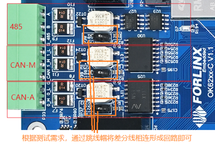

**Note: UART1 does not support 14400 and 380400 bps. The test program provided by Forx sends a string of 30 random characters. You can modify it according to your own needs. Before conducting the serial port test, please check if the P38 jumper cap is connected. If not, connect it before testing.**

**The location of the command - line serial port test program: OK62xx - linux - sdk/appsrc/forlinx - cmd/uarttest.**

1. Execute the serial port test program on the terminal of Development Board 1 and set it to the receiving mode:

```plain
root@ok62xx:/#fltest_uarttest -d /dev/ttyS3 r
```

2. The terminal of development board 1 print as follows, waiting to receive information:

```plain
Welcome to uart test
```

3.  Execute the serial port test program on the development board 2 terminal, and set the sending mode to send data:

```plain
root@ok62xx:/#fltest_uarttest -d /dev/ttyS3 w
send data:cxsNEayKX7h7coQBJRkS42VHKFrFp
send data:EyvLmQjnZvQXbfBjBnnsVzaUX0sy6
send data:eR2MI1SnEkmwRVENCnfVeIg6XucDd
send data:1SYr1XjjYnQQd4V9SDrc1SNnd4Jo3
send data:vop4dKj5MYfZlhcM5uTuPKvLuhRs9
send data:ZaPzNMxgHCCK31DHVAD0NBUP8AqHZ
send data:M7evObTnnQnRlI6QLYQvDmHNQjucy
send data:L3lzrPkFZf8nBPVX88kSea2LeyX15
send data:naxifU6FPIwu5GvYaeiMI8RheDGz8
send data:QqSDg9tOJOeLQSbgXewssXMcwgQEY
```

4. At this time, Development Board 1 receives the serial port information sent by Development Board 2 and adds the contents of the reading.

```plain
Welcome to uart test
recv data:cxsNEayKX7h7coQBJRkS42VHKFrFp
recv data:EyvLmQjnZvQXbfBjBnnsVzaUX0sy6
recv data:eR2MI1SnEkmwRVENCnfVeIg6XucDd
recv data:1SYr1XjjYnQQd4V9SDrc1SNnd4Jo3
recv data:vop4dKj5MYfZlhcM5uTuPKvLuhRs9
recv data:ZaPzNMxgHCCK31DHVAD0NBUP8AqHZ
recv data:M7evObTnnQnRlI6QLYQvDmHNQjucy
recv data:L3lzrPkFZf8nBPVX88kSea2LeyX15
recv data:naxifU6FPIwu5GvYaeiMI8RheDGz8
recv data:QqSDg9tOJOeLQSbgXewssXMcwgQEY
recv data:73kDE8kI3l4mFILQ6UJaZqT8KiFkX
```

5. Set the 485 serial port of Development Board 2 to receive mode:

```plain
root@ok62xx:/#fltest_uarttest -d /dev/ttyS3 r
```

6. Set the 485 serial port of the development board 1 to the sending mode:

```plain
root@ok62xx:~# fltest_uarttest -d /dev/ttyS3 w
Welcome to uart test
send data:tKTD4axT4hyUVeKp5Uo0kjeNPiw5u
send data:Y26vrZkDtAdfW7vU2KINwz2rRPrld
send data:rdlmnFZYePSZEGyRkGT78Svj7YNOE
send data:4ixkbiax6lP02yfQ0IKkizQQKdxNb
send data:3NG3TJRzED6H4Wu9dNwY0MhUQ9LIE
send data:YudtJB0GgS8elYQC4HlGu4viAoS90
```

7. Development board 2 receives the serial port information sent by development board 1:

```plain
root@ok62xx:~# fltest_uarttest -d /dev/ttyS3 r
Welcome to uart test
recv data:tKTD4axT4hyUVeKp5Uo0kjeNPiw5u
recv data:Y26vrZkDtAdfW7vU2KINwz2rRPrld
recv data:rdlmnFZYePSZEGyRkGT78Svj7YNOE
recv data:4ixkbiax6lP02yfQ0IKkizQQKdxNb
recv data:3NG3TJRzED6H4Wu9dNwY0MhUQ9LIE
recv data:YudtJB0GgS8elYQC4HlGu4viAoS90
recv data:UxZw4HNkylxPwIOS2M6BiSLKmtXJw
```

8. Development boards 1 and 2 are successful in sending messages and receiving each other's 485 serial port to send the contents of the test is successful.

### **3.6 QSPI Test**

There are three groups of SPI interfaces on the P35 pins of the OK62xx - C carrier board. Among them, the pins prefixed with OSPI are connected to the A53 core, the pins prefixed with MCU are connected to the M4 core, and the pins prefixed with QSPI are connected to the QSPI Flash on the baseboard. During the test, please connect the QSPI Flash to the A53 core by referring to the green lines in the schematic diagram:

Connect OSPI\_DQ0\_3.3V and QSPI\_D0;

Connect OSPI\_DQ1\_3.3V and QSPI\_D1;

Connect OSPI\_DQ2\_3.3V and QSPI\_D2;

Connect OSPI\_CLK\_3.3V and QSPI\_CLK;

Connect OSPI\_CSN0\_3.3V and QSPI\_CSn;

Connect OSPI\_DQ3\_3.3V and QSPI\_D3;

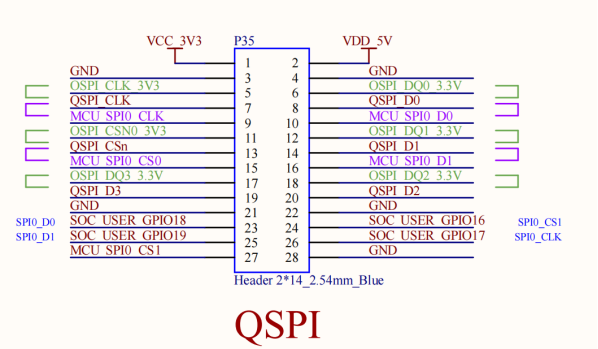

1\. Check QSPIFlash partition information;

```plain
root@ok62xx:/# cat /proc/mtd
dev:    size   erasesize  name
mtd0: 01000000 00001000 "fc40000.spi.0"
```

2\. Format the QSPI Flash partition into jffs2 format; (NOR Flash is slower to format)

```plain
root@ok62xx:/# flash_erase -j /dev/mtd0 0 0
Erasing 16384 Kibyte @ 0 -- 100 % complete flash_erase: 0 : Cleanmarker Updated.
flash_erase: 1000 : Cleanmarker Updated.
flash_erase: 2000 : Cleanmarker Updated.
flash_erase: 3000 : Cleanmarker Updated.
flash_erase: 4000 : Cleanmarker Updated.
……//Omit the unimportant information
flash_erase: ffc000 : Cleanmarker Updated.
flash_erase: ffd000 : Cleanmarker Updated.
flash_erase: ffe000 : Cleanmarker Updated.
flash_erase: fff000 : Cleanmarker Updated.

```

3\. Mount the file system and view it;

```plain
root@ok62xx:/# mount -t jffs2 /dev/mtdblock0 /mnt/
root@ok62xx:/# df
Filesystem     1K-blocks    Used Available Use% Mounted on
/dev/root        6981728 5564956   1034956  85% /
devtmpfs          918548       4    918544   1% /dev
tmpfs             985268       0    985268   0% /dev/shm
tmpfs             394108   10184    383924   3% /run
tmpfs               4096       0      4096   0% /sys/fs/cgroup
tmpfs             985268       4    985264   1% /tmp
tmpfs              16384       0     16384   0% /media/ram
tmpfs              51200       8     51192   1% /var/volatile
/dev/mmcblk0p1     84998    2368     82630   3% /run/media/Boot-mmcblk0p1
tmpfs             197052       0    197052   0% /run/user/1000
tmpfs             197052       0    197052   0% /run/user/0
/dev/mtdblock0     16384     784     15600   5% /mnt
root@ok62xx:/# umount /mnt
```

4\. QSPIFlash Write Test;

```plain
root@ok62xx:/# dd if=/dev/zero of=/dev/mtdblock0 bs=1M count=16 conv=fsync
16+0 records in
16+0 records out
16777216 bytes (17 MB, 16 MiB) copied, 224.983 s, 74.6 kB/s

```

5\. QSPIFlash Read test.

```plain
root@ok62xx:/# dd if=/dev/mtdblock0 of=/dev/null bs=1M count=16
16+0 records in
16+0 records out
16777216 bytes (17 MB, 16 MiB) copied, 6.77845 s, 2.5 MB/s
```

### **3.7 CAN Test**

There are two CAN ports, CAN0 and CAN1, on the carrier board. CAN0 is the CAN port from core A, and CAN1 is the CAN port from core M. (The M-core can firmware is not yet supported, so CAN 1 is not available.) Two OK62xx development boards 1 and 2 are required to connect the H and L terminals of the two CAN0 ports.

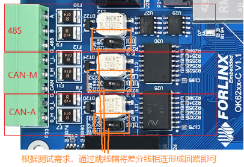

**Note: Before conducting the can test, please check whether the P37 jumper cap is connected. If not, please connect it and then conduct the test.**

1. Set up the can0 service for both development boards as follows:

```plain
root@OK62xx:~#ip link set can0 up type can bitrate 500000 
```

2. Set can0 of development board 1 to receive data

```plain
root@OK62xx:~# candump can0& //CAN0 is in receive mode
```

Set can0 of development board 2 to send data

```plain
root@OK62xx:~# cangen  can0                                //CAN0 sends frame data randomly 
Below is the received data displayed by the terminal:
can0  45A  [07]  43 01 EE 4E A9 9E 3F
can0  1DA06D95  [02]  F4 E9
can0  0BCF8D36   [8]  AC 5C C7 7F EC F4 9F 7E
can0  0832890C  [00] 
can0  09F4D7CD   [8]  51 54 73 4F BB 6A 79 6A
can0  13B2823D   [8]  40 2C D0 5C 8F 57 C9 79
can0  0EE9DC18  [12]  AF 87 59 5A 5B DD D7 3D AF 87 59 5A
can0  1A62C23A  [00] 
can0  0AA9769A   [4]  70 82 B4 47
can0       75B   [2]  E0 CD
can0  0C1CD5B1   [5]  A2 F8 1C 79 02
can0       40F   [8]  BF D7 3D 02 4F F0 DE 60
can0       2B7  [07]  B8 B7 52 72 66 FA D4
can0       24B  [00] 
can0       434  [16]  33 A2 52 41 A4 CE 7D 01 33 A2 52 41 A4 CE 7D 01
can0       083   [8]  C3 94 01 08 64 9E 07 41
can0       018   [5]  9D 63 59 6D BA
can0       50E   [8]  remote request
can0  01034E26   [4]  remote request
can0       343  [12]  8A C6 03 7D F5 BF 84 65 8A C6 03 7D
can0  1C612F59   [8]  remote request
can0  1BBE9C53   [8]  CD 28 44 2B 16 31 C0 43
[…]
```

3. Other common commands

Check CAN bus status:

```plain
root@OK62xx:~#ip -details -statistics link show can0
2: can0: <NOARP,ECHO>mtu 72 qdiscpfifo_fast state DOWN mode DEFAULT group default qlen10
link/can  promiscuity 0 minmtu 0 maxmtu 0 
can <FD> state STOPPED (berr-counter tx 0 rx 0) restart-ms 200
bitrate 498750 sample-point 0.870 
tq 20 prop-seg 43 phase-seg1 43 phase-seg2 13 sjw 1
rcar_canfd: tseg1 2..128 tseg2 2..32 sjw 1..32 brp 1..1024 brp-inc 1
dbitrate 1995000 dsample-point 0.680 
dtq 20 dprop-seg 8 dphase-seg1 8 dphase-seg2 8 dsjw 1
rcar_canfd: dtseg1 2..16 dtseg2 2..8 dsjw 1..8 dbrp 1..256 dbrp-inc 1
clock 49875000 
re-started bus-errors arbit-lost error-warn error-pass bus-off
0          0          0          0          0          0         numtxqueues 1 numrxqueues 1 gso_max_size 65536 gso_max_segs 65535 
RX: bytes  packets  errors  dropped overrun mcast
0          0        0       0       0       0       
TX: bytes  packets  errors  dropped carrier collsns
0          0        0       0       0       0      

```

4. Set the bus-off reset time of the bus:

```plain
root@OK62xx:~# ifconfig can0 down
root@OK62xx:~# ip link set can0 type can restart-ms 100
root@OK62xx:~# ip -details -statistics link show can0
2: can0: <NOARP,ECHO>mtu 72 qdiscpfifo_fast state DOWN mode DEFAULT group default qlen 10
link/can  promiscuity 0 minmtu 0 maxmtu 0 
can <FD> state STOPPED (berr-counter tx 0 rx 0) restart-ms 100//复位时间为100
bitrate 498750 sample-point 0.870 
tq 20 prop-seg 43 phase-seg1 43 phase-seg2 13 sjw 1
rcar_canfd: tseg1 2..128 tseg2 2..32 sjw 1..32 brp 1..1024 brp-inc 1
dbitrate 1995000 dsample-point 0.680 
dtq 20 dprop-seg 8 dphase-seg1 8 dphase-seg2 8 dsjw 1
rcar_canfd: dtseg1 2..16 dtseg2 2..8 dsjw 1..8 dbrp 1..256 dbrp-inc 1
clock 49875000 
re-started bus-errors arbit-lost error-warn error-pass bus-off
0          0          0          0          0          0         numtxqueues 1 numrxqueues 1 gso_max_size 65536 gso_max_segs 65535 
RX: bytes  packets  errors  dropped overrun mcast
0          0        0       0       0       0       
TX: bytes  packets  errors  dropped carrier collsns
0          0        0       0       0       0
```

5. Set send queue length:

```plain
root@OK62xx:~# ip link set dev can0 txqueuelen 100
root@OK62xx:~# ip -details -statistics link show can0
2: can0: <NOARP,ECHO>mtu 72 qdiscpfifo_fast state DOWN mode DEFAULT group default qlen100  //The queue length becomes 100
link/can  promiscuity 0 minmtu 0 maxmtu 0 
can <FD> state STOPPED (berr-counter tx 0 rx 0) restart-ms 100 
bitrate 498750 sample-point 0.870 
tq 20 prop-seg 43 phase-seg1 43 phase-seg2 13 sjw 1
rcar_canfd: tseg1 2..128 tseg2 2..32 sjw 1..32 brp 1..1024 brp-inc 1
dbitrate 1995000 dsample-point 0.680 
dtq 20 dprop-seg 8 dphase-seg1 8 dphase-seg2 8 dsjw 1
rcar_canfd: dtseg1 2..16 dtseg2 2..8 dsjw 1..8 dbrp 1..256 dbrp-inc 1
clock 49875000 
re-started bus-errors arbit-lost error-warn error-pass bus-off
0          0          0          0          0          0         numtxqueues 1 numrxqueues 1 gso_max_size 65536 gso_max_segs 65535 
RX: bytes  packets  errors  dropped overrun mcast
0          0        0       0       0       0       
TX: bytes  packets  errors  dropped carrier collsns
0          0        0       0       0       0   
```

6. Set can to canfd mode:

Set up the can0 service for both development boards as follows:

```plain
root@OK62xx:~# ip link set can0 up type can bitrate 500000 dbitrate 2000000 fd on
```

Use the following command to send random FD data frames:

```plain
root@OK62xx:~# cangen -m can0
```

The rest of the test commands are the same as in CAN mode.

### **3.8 Watchdog Test**

Watchdog is a function that is often used in embedded systems. The device node of the watchdog in OK62xx is the/dev/watchdog device file. After the watchdog starts, if the watchdog is not fed, the system will be reset after 10 seconds.

| Executable file         | <font style="color:rgb(0,0,0);">Meaning</font>               | Source code path Name                                        |
| :---------------------- | :----------------------------------------------------------- | :----------------------------------------------------------- |
| <fltest\_watchdog       | Turn on the watchdog, set the<br />reset time, and feed the dog at a<br />timer of 1s. | OK62xx-linux-sdk/appsrc/forlinx-<br />cmd/watchdog/watchdog.c |
| fltest\_watchdogrestart | Turn on the watchdog, but do not perform the feed dog operation,<br />the system will reboot after 10s | OK62xx-linux-sdk/appsrc/forlinx-<br />cmd/watchdogrestart/watchdogrestart.c |

Enable watchdog

```plain
root@ok62xx:~# fltest_watchdog
Watchdog Ticking Away!
```

This command turns on the watchdog and performs a feed, so the system does not reboot.

**Note: When using Ctrl+C to end the test program, the system will reset after 10 seconds. At present, closing the watchdog is not supported.**

Execute: fltest\_watchdogrestart

```plain
root@ok62xx:~# fltest_watchdogrestart
Restart after 10 seconds
```

This command turns on the watchdog, but does not feed the dog, and the system reboots after 10 seconds.

**Note: The watchdog in OK62 does not support dog stop operation.**

### **3.9 WiFi Test**

#### **3.9.1 STA Mode**

**Note: The AW-CM358SM supports 2.4/5GHz**

This mode means that it acts as a station and connects to the wireless network. In the following test, the router uses WPA encryption, the connected wifi hotspot name is: H3C\_708\_5G and the password is: 123456785. Due to the different network environments, users should set up according to the actual situation when conducting this test:

1\. Enter the following command in the development board terminal:

```plain
root@ok62xx:~# fltest_wifi.sh -i mlan0 -s H3C_708_5G  -p 123456785.
```

The meanings of relevant parameters in the command are as follow:

| Parameter | **<font style="color:rgb(0,0,0);">Meaning</font>**           |
| :-------: | ------------------------------------------------------------ |
|    -i     | Wifi device name：mlan0                                      |
|    -s     | Actual wifi hotspot connected                                |
|    -p     | The following parameter Password refers to the password of the actual WiFi hotspot to<br />be connected; If the current hotspot does not have a password, write NONE as the<br />parameter after - p. |

The serial port prints as follows:

```plain
uap0: interface state ENABLED->DISABLED
uap0: AP-DISABLED
uap0: CTRL-EVENT-TERMINATING
nl80211: deinit ifname=uap0 disabled_11b_rates=0
udhcpd: received SIGTERM
udhcpd: can't open '/var/lib/misc/udhcpd.leases': No such file o[  354.326024] wlan: Stoping AP
r directory
wifi mlan0
ssid H3C_708_5G
pasw 123456785.
[  354.332444] wlan: AP stopped
[  354.384680] am65-cpsw-nuss 8000000.ethernet eth0: Link is Down
waiting...
[  356.690926] wlan: mlan0 START SCAN
try to connect again...
[  361.238265] wlan: SCAN COMPLETED: scanned AP count=5
[  361.255003] wlan: Connected to bssid 14:XX:XX:XX:fc:87 successfully
[  361.266452] mlan0:
[  361.266471] wlan: Send EAPOL pkt to 14:XX:XX:XX:fc:87
[  361.275932] mlan0:
[  361.275947] wlan: Send EAPOL pkt to 14:XX:XX:XX:fc:87
[  361.284236] IPv6: ADDRCONF(NETDEV_CHANGE): mlan0: link becomes ready
[  361.291371] woal_cfg80211_set_rekey_data return: gtk_rekey_offload is DISABLE
udhcpc: started, v1.31.1
udhcpc: sending discover
udhcpc: sending select for 192.168.1.27
udhcpc: lease of 192.168.1.27 obtained, lease time 86400
/etc/udhcpc.d/50default: Adding DNS 192.168.1.1
Finshed!
```

2\. Check whether it can ping the external network and enter the following command in the terminal:

```plain
root@ok62xx:~# ping forlinx.com -c 4               //Assign the wlan0 NIC to ping 4 times
PING forlinx.com (211.149.226.120): 56 data bytes
64 bytes from 211.149.226.120: seq=0 ttl=51 time=42.561 ms
64 bytes from 211.149.226.120: seq=1 ttl=51 time=39.951 ms
64 bytes from 211.149.226.120: seq=2 ttl=51 time=41.164 ms
64 bytes from 211.149.226.120: seq=3 ttl=51 time=40.714 ms

--- forlinx.com ping statistics ---
4 packets transmitted, 4 packets received, 0% packet loss
round-trip min/avg/max = 39.951/41.097/42.561 ms
root@ok62xx:~#
```

Being able to ping indicates that the network can be used normally at this time.

### **3.10 AP Mode**

**Note: Before this test, it is necessary to ensure that the Gigabit NIC eth0 is connected to the network and normal.**

1\. Configure Hotspot;

WiFi hotspot name：OK6254\_WIFI\_2.4G\_AP

Password: 12345678

The hotspot name and password are viewed through the /etc/hostapd-2.4G.conf file.

```plain
root@ok62xx:~# fltest_hostapd.sh
[  565.346854] wlan: Received disassociation request on mlan0, reason: 3
[  565.353448] wlan: REASON: (Deauth) Sending STA is leaving (or has left) IBSS or ESS
root@ok6254:~# udhcpd: started, v1.31.1
udhcpd: can't open '/var/lib/misc/udhcpd.leases': No such file or directory
Configuration file: /etc/hostapd-2.4g.conf
Using interface uap0 with hwaddr b4:8c:9d:73:f1:57 and ssid "OK6254_WIFI_2.4G_AP"
[  566.479918] wlan: Starting AP
[  566.483560] Get ht_cap from beacon ies: 0xc
[  566.488265] fw doesn't support 11ax
[  566.502487] wlan: AP started
[  566.507939] Set AC=3, txop=47 cwmin=3, cwmax=7 aifs=1
[  566.515144] Set AC=2, txop=94 cwmin=7, cwmax=15 aifs=1
[  566.522397] Set AC=0, txop=0 cwmin=15, cwmax=63 aifs=3
[  566.529581] Set AC=1, txop=0 cwmin=15, cwmax=1023 aifs=7
uap0: interface state UNINITIALIZED->ENABLED
uap0: AP-ENABLED
```

### **3.11 RTC Function Test**

RTC test mainly involves setting the software and hardware time using the "date" and "hwclock" tools. The purpose is to test whether the software clock can synchronize with the RTC clock when the development board is powered off and then powered on again. (Note: Make sure that a button battery is installed on the board and the battery voltage is normal.)

Set the time as follows command:

```plain
root@ok62xx:~# date -s "2022-05-19 11:09:10"
Thu May 19 11:09:10 UTC 2022
```

Read the current time:

```plain
root@ok62xx:~# date
Thu May 19 11:09:41 UTC 2022
```

Write the system time to the RTC:

```plain
root@ok62xx:~# hwclock -w
```

Check the hardware time:

```plain
root@ok62xx:~# hwclock --show
2022-05-19 11:10:01.991033+00:00
```

<font style="color:rgb(0,0,0);">Then power down and power up the board, enter the system, and read the system time. After that, we can see that the time has synchronized.</font>

```plain
root@ok62xx:~# date
Thu May 19 11:11:14 UTC 2022
```

### **3.12 Bluetooth Test**

The **AW-CM358SM** of the OK62-C carrier board has integrated Bluetooth. This section demonstrates the use of Bluetooth for file transfer between the phone and the development board.

1\. Bluetooth initialization

```plain
root@ok62xx:~# /etc/init.d/bluetooth start
[  651.469999] Bluetooth: Core ver 2.22
[  651.473863] NET: Registered protocol family 31
[  651.478350] Bluetooth: HCI device and connection manager initialized
[  651.484748] Bluetooth: HCI socket layer initialized
[  651.489637] Bluetooth: L2CAP socket layer initialized
[  651.494718] Bluetooth: SCO socket layer initialized
[  651.507108] Bluetooth: HCI UART driver ver 2.3
[  651.511658] Bluetooth: HCI UART protocol H4 registered
[  651.516815] Bluetooth: HCI UART protocol BCSP registered
[  651.522250] Bluetooth: HCI UART protocol LL registered
[  651.527758] Bluetooth: HCI UART protocol Broadcom registered
[  651.533546] Bluetooth: HCI UART protocol QCA registered
root@ok62xx:~# [  651.778142] NET: Registered protocol family 38
[  651.808145] Bluetooth: RFCOMM TTY layer initialized
[  651.813183] Bluetooth: RFCOMM socket layer initialized
[  651.818394] Bluetooth: RFCOMM ver 1.11
```

**Note: If the following log (the red part) pops up, please check if there is a “root” directory under the “/home” directory. If not, you need to create it.**

```plain
root@OK62xx:/# /etc/init.d/bluetooth start
[   30.805784] Bluetooth: Core ver 2.22
[   30.809609] NET: Registered PF_BLUETOOTH protocol family
[   30.814990] Bluetooth: HCI device and connection manager initialized
[   30.821401] Bluetooth: HCI socket layer initialized
[   30.826298] Bluetooth: L2CAP socket layer initialized
[   30.831390] Bluetooth: SCO socket layer initialized
[   30.850495] Bluetooth: HCI UART driver ver 2.3
[   30.855113] Bluetooth: HCI UART protocol H4 registered
[   30.860268] Bluetooth: HCI UART protocol BCSP registered
[   30.865724] Bluetooth: HCI UART protocol LL registered
[   30.871366] Bluetooth: HCI UART protocol Broadcom registered
[   30.877164] Bluetooth: HCI UART protocol QCA registered
[   30.882524] Bluetooth: HCI UART protocol Marvell registered
root@OK62xx:/# [   31.097207] Bluetooth: MGMT ver 1.22
[   31.110416] NET: Registered PF_ALG protocol family
[   31.115420] kauditd_printk_skb: 1 callbacks suppressed
[   31.115434] audit: type=1334 audit(1703225916.360:15): prog-id=13 op=LOAD
[   31.127749] audit: type=1334 audit(1703225916.364:16): prog-id=14 op=LOAD
```

3\. Bluetooth Configuration

```plain
root@ok62xx:~# bluetoothctl // Open the BlueZ Bluetooth device
Agent registered
[CHG] Controller F0:C8:14:48:08:85 Pairable: yes
[bluetooth]# power on // Start the Bluetooth device
[CHG] Controller F0:C8:14:48:08:85 Class: 0x00100000
Changing power on succeeded
[CHG] Controller F0:C8:14:48:08:85 Powered: yes
[bluetooth]# pairable on // Set it to pairing mode
Changing pairable on succeeded
[bluetooth]# discoverable on // Set it to discoverable mode
Changing discoverable on succeeded
[CHG] Controller F0:C8:14:48:08:85 Discoverable: yes
[bluetooth]# scan on // Search for discoverable Bluetooth devices
Discovery started
[CHG] Controller F0:C8:14:48:08:85 Discovering: yes
[NEW] Device 2C:DB:07:C7:4F:F6 DESKTOP-VND9V1F
[NEW] Device 88:F8:72:0A:A0:0F huawei
[NEW] Device 72:F4:8B:A8:49:28 72-F4-8B-A8-49-28
[NEW] Device F8:89:D2:D1:98:18 DESKTOP-O9UHFC7
[NEW] Device C0:0B:06:01:0A:38 Mi Smart Band 5
[CHG] Device F8:89:D2:D1:98:18 RSSI: -56
[bluetooth]# agent on // Start the agent
Agent is already registered
[bluetooth]# default-agent // Set the current agent as the default
Default agent request successful
```

4\. Development Board Passive Pairing

After the above settings, open the mobile phone Bluetooth search, and a "ok62xx" device will appear. Click this Bluetooth to try to pair.

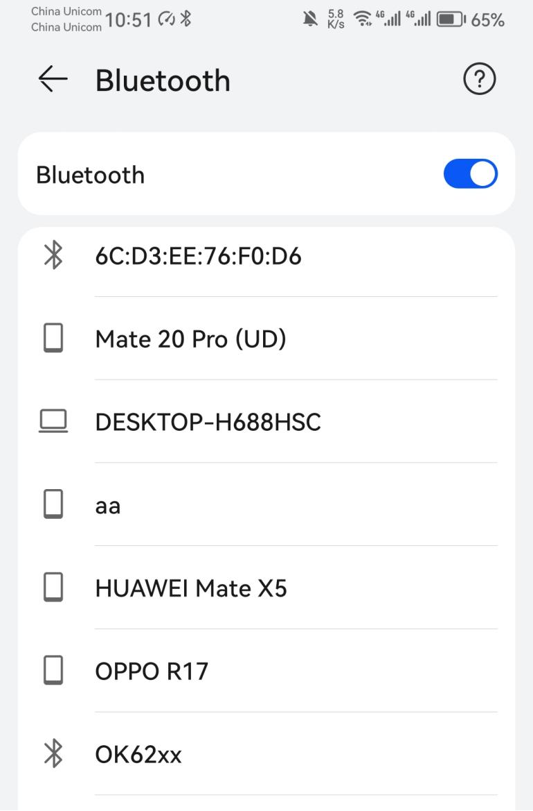

At the same time the printing message displays on the development board as follows, enter yes

```plain
[CHG] Device 88:F8:72:0A:A0:0F Connected: yes
Request confirmation
[agent] Confirm passkey 776871 (yes/no): yes
```

Then, tap on Bluetooth on your phone to initiate pairing.

View and remove connected devices:

```plain
[bluetooth]# devices // View the connected Bluetooth devices
Device 88:F8:72:0A:A0:0F huawei
[bluetooth]# remove 88:F8:72:0A:A0:0F // Remove the device
[DEL] Device 88:F8:72:0A:A0:0F huawei
Device has been removed
```

4\. Development board active pairing

In addition to passive pairing, it is also possible to send an active pairing request from the development board terminal.

```plain
[bluetooth]# scan on // Search for discoverable Bluetooth devices
Discovery started
[CHG] Controller F0:C8:14:48:08:85 Discovering: yes
[NEW] Device 2C:DB:07:C7:4F:F6 DESKTOP-VND9V1F
[NEW] Device 88:F8:72:0A:A0:0F huawei
[NEW] Device 72:F4:8B:A8:49:28 72-F4-8B-A8-49-28
[NEW] Device F8:89:D2:D1:98:18 DESKTOP-O9UHFC7
[NEW] Device C0:0B:06:01:0A:38 Mi Smart Band 5
[CHG] Device F8:89:D2:D1:98:18 RSSI: -56
[bluetooth]# scan off // Stop the search
Discovery stopped
[bluetooth]# pair 88:F8:72:0A:A0:0F // Pair with the Bluetooth device
Attempting to pair with 88:F8:72:0A:A0:0F
[CHG] Device 88:F8:72:0A:A0:0F Connected: yes
Request confirmation
[agent] Confirm passkey 272568 (yes/no): [DEL] Device 69:6B:A6:34:DF:95 69-6B-A6-34-DF-95
[agent] Confirm passkey 272568 (yes/no): [DEL] Device C0:0B:06:01:0A:38 Mi Smart Band 5
[agent] Confirm passkey 272568 (yes/no): yes // Confirm the passkey
[CHG] Device 88:F8:72:0A:A0:0F Modalias: bluetooth:v010Fp107Ed1436
[CHG] Device 88:F8:72:0A:A0:0F ServicesResolved: yes
[CHG] Device 88:F8:72:0A:A0:0F Paired: yes
Pairing successful
```

At the same time, the pairing request appears on the mobile phone interface. Click the pairing button, and the board end prints and inputs yes. The pairing on the mobile phone end is successful.

5\. Development board to receive documents

After successful pairing, on the mobile side, you can use Bluetooth to send files to ok62xx.

The received file is saved in the/Homer/root directory.

6\. The development board sends files

Similarly, OK 62xx-C can send the file to the PC, and the test method is as follows:

```plain
root@ok62xx:~# bluetoothctl
Agent registered
[CHG] Controller F0:C8:14:60:CA:F6 Pairable: yes
[bluetooth]# devices
Device 2C:DB:07:C7:4F:F6 DESKTOP-VND9V1F //View the MAC of a device that has been paired
```

Window selects "Bluetooth"- "Accept File"


```plain
root@ok62xx:~# fltest_obexd.sh 
[NEW] Client /org/bluez/obex
[obex]# connect 2C:DB:07:C7:4F:F6 // Connect to the MAC address of the Bluetooth device
that needs to communicate. Please use the "paired-devices" command in bluetoothctl to
view it. Before using the "connect" command, make sure the Bluetooth is powered on.
Attempting to connect to 88:F8:72:0A:A0:0F
[NEW] Session /org/bluez/obex/client/session0 [default]
[NEW] ObjectPush /org/bluez/obex/client/session0 
Connection successful
[88:F8:72:0A:A0:0F]# send /home/root/test.ipg // Send a file
```

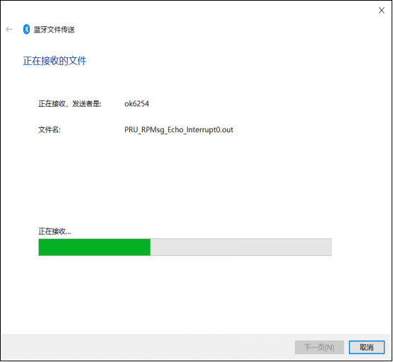

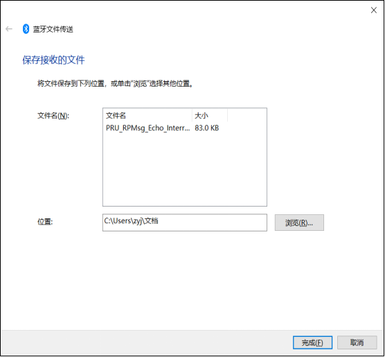

### **3.13 USB Interface Test**

#### **3.13.1 USB Mouse Test**

Connect the usb mouse to the usb interface of the OK62 platform, and the serial terminal prints the following information:

```plain
[  257.039701] usb 1-1.2: USB disconnect, device number 3
[  258.210804] usb 1-1.2: new low-speed USB device number 4 using xhci-hcd
[  258.477925] input: USB OPTICAL MOUSE as /devices/platform/bus@f0000/f910000.dwc3-
usb/31100000.usb/xhci-hcd.2.auto/usb1/1-1/1-1.2/1-1.2:1.0/0003:30FA:0300.0002/input/input5
[  258.493840] hid-generic 0003:30FA:0300.0002: input: USB HID v1.11 Mouse [USB OPTICAL MOUSE ] on usb-xhci-hcd.2.auto-1.2/input0
```

At this time, the arrow cursor appears on the screen, the mouse can work normally.

When the USB mouse is disconnected, the printout in the serial terminal is as follows:

```plain
[ 1100.514550] usb 1-1.2: USB disconnect, device number 4
```

The arrow cursor on the screen disappears and the mouse is successfully removed.

#### **3.13.2 USB2.0**

**Note: **

- **To make sure the data is accurate, please restart the development board and test the reading speed;**

- **Exit the USB flash driver mounting path and then plug and unplug the USB flash driver.**

Ok62xx supports two USB2.0 interfaces. You can connect USB mice, USB keyboards, U disks and other devices to any on-board USB HOST interface, and support hot plugging of these devices. Here is an example of mounting a USB flash disk for demonstration:

The terminal will print the information about the USB flash disk. As there are many kinds of USB flash disks, the displayed information may be different:

**Step 1:**

After the development board boots up, connect a USB interface USB flash drive to the USB HOST port of the development board. Serial port information:

```plain
[ 1205.006263] usb 1-1.2: new high-speed USB device number 4 using xhci-hcd
[ 1205.210636] usb 1-1.2: New USB device found, idVendor=23a9, idProduct=ef18, bcdDevice= 1.00
[ 1205.218993] usb 1-1.2: New USB device strings: Mfr=1, Product=2, SerialNumber=0
[ 1205.226302] usb 1-1.2: Product: DISK
[ 1205.229868] usb 1-1.2: Manufacturer: USB
[ 1205.250813] usb-storage 1-1.2:1.0: USB Mass Storage device detected
[ 1205.257797] scsi host0: usb-storage 1-1.2:1.0
[ 1205.262953] usbcore: registered new interface driver usb-storage
[ 1206.282807] scsi 0:0:0:0: Direct-Access     SCSI     DISK             1.00 PQ: 0 ANSI: 4
[ 1206.291850] sd 0:0:0:0: [sda] 31223936 512-byte logical blocks: (16.0 GB/14.9 GiB)
[ 1206.300528] sd 0:0:0:0: [sda] Write Protect is off
[ 1206.305532] sd 0:0:0:0: [sda] Mode Sense: 03 00 00 00
[ 1206.306291] sd 0:0:0:0: [sda] No Caching mode page found
[ 1206.311686] sd 0:0:0:0: [sda] Assuming drive cache: write through
[ 1206.346071]  sda: sda1
[ 1206.350505] sd 0:0:0:0: [sda] Attached SCSI removable disk
```

**Step 2:**

View the mount directory:

```plain
root@ok62xx:~#ls /run/media
mmcblk0p1  sda1
```

**Step3:**

View the contents of the USB flash drive:

```plain
root@ok62xx:~#ls -l /run/media/sda1
```

The test results may be different for different core SoMs. The following test results take OK6254 as an example.

Write test:

```plain
root@ok62xx:~#dd if=/dev/zero of=/run/media/sda1/test bs=1M count=50 conv=fsync oflag=direct
50+0 records in
50+0 records out
52428800 bytes (52 MB, 50 MiB) copied, 5.09789 s, 10.3 MB/s
```

Read test：

```plain
root@ok62xx:~#dd if=/run/media/sda1/test of=/dev/null bs=1M iflag=direct
50+0 records in
50+0 records out
52428800 bytes (52 MB, 50 MiB) copied, 1.78257 s, 29.4 MB/s
```

#### **3.13.3 OTG Test**

The carrier board uses the USB1 led out from the SoM as a USB 2.0 OTG, which can be used as an OTG interface.

There is an OTG interface (P22). In Device mode, it can be used to connect to a PC. In Host mode, general USB devices can be plugged in. When switch S3 is set to ON, the system sets the OTG interface to Host mode. You can use an OTG-to-USB cable to connect devices such as USB flash drives. When switch S3 is set to OFF, the system sets the OTG interface to Device mode. You can use an OTG cable to connect OK6254-C.

**Host Mode:**

When switch S3 is set to "on", connect USB1 to a Micro - C to USB - A (female) cable and then connect an external USB flash drive. The USB flash drive is correctly recognized, and the printed information is as follows:

```plain
[  237.559429] usb 3-1: new high-speed USB device number 2 using xhci-hcd
[  237.711839] usb 3-1: New USB device found, idVendor=23a9, idProduct=ef18, bcdDevice= 1.00
[  237.720034] usb 3-1: New USB device strings: Mfr=1, Product=2, SerialNumber=0
[  237.727175] usb 3-1: Product: DISK
[  237.730589] usb 3-1: Manufacturer: USB
[  237.735518] usb-storage 3-1:1.0: USB Mass Storage device detected
[  237.742438] scsi host0: usb-storage 3-1:1.0
[  238.764046] scsi 0:0:0:0: Direct-Access     SCSI     DISK             1.00 PQ: 0 ANSI: 4
[  238.773171] sd 0:0:0:0: [sda] 31223936 512-byte logical blocks: (16.0 GB/14.9 GiB)
[  238.781434] sd 0:0:0:0: [sda] Write Protect is off
[  238.786382] sd 0:0:0:0: [sda] Mode Sense: 03 00 00 00
[  238.786884] sd 0:0:0:0: [sda] No Caching mode page found
[  238.792318] sd 0:0:0:0: [sda] Assuming drive cache: write through
[  238.823431]  sda: sda1
[  238.828053] sd 0:0:0:0: [sda] Attached SCSI removable disk[ 1456.778364] sd 0:0:0:0: [sda] tag#0 CDB: opcode=0x28 28 00 03 b7 23 fd 00 00 01 00
root@ok62xx:~# ls /run/media/
mmcblk0p1  sda1
```

At this time, the USB flash drive has been recognized, and you can operate on it.

When switch S3 is set to "off", USB0 exits the HOST mode.

```plain
[  396.914060] xhci-hcd xhci-hcd.1.auto: remove, state 4
[  396.919261] usb usb4: USB disconnect, device number 1
[  396.926827] xhci-hcd xhci-hcd.1.auto: USB bus 4 deregistered
[  396.932604] xhci-hcd xhci-hcd.1.auto: remove, state 1
[  396.937709] usb usb3: USB disconnect, device number 1
[  396.942769] usb 3-1: USB disconnect, device number 2
[  396.987359] xhci-hcd xhci-hcd.1.auto: USB bus 3 deregistered
[  397.059723] FAT-fs (sda1): unable to read boot sector to mark fs as dirty
```

**Device Mode:**

When switch S3 is set to "off", connect USB0 to a Micro - C to USB - A (male) cable and then connect it to a PC host. Test the OTG as a USB 2.0 DEVICE end, and map the first partition of the eMMC to a USB flash drive and mount it on the PC.

Mounting driver:

The PC recognizes the mmcblk0p1 partition of the eMMC on the OK62xx - C development board as follows:

After opening, the file content is as follows:

```plain
root@ok62xx:~#modprobe g_mass_storage file=/dev/mmcblk1p1 removable=1
[  466.883689] Mass Storage Function, version: 2009/09/11
[  466.888867] LUN: removable file: (no medium)
[  466.893357] LUN: removable file: /dev/mmcblk0p2
[  466.897907] Number of LUNs=1
[  466.901015] g_mass_storage gadget: Mass Storage Gadget, version: 2009/09/11
[  466.908078] g_mass_storage gadget: userspace failed to provide iSerialNumber
[  466.915132] g_mass_storage gadget: g_mass_storage ready
```


After opening, the file contents are as follows:

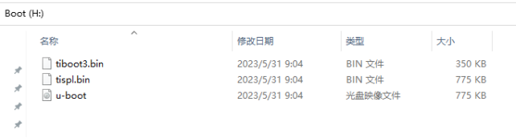

### **3.14 LCD Backlight Adjustment**

Backlight level range (0--255), maximum level 255, 0 indicating turn off. Enter the system and enter the following command in the terminal to perform the backlight test. Take LCD screen backlight as an example.

**Note: The interface will be different when using different screens. Please enter the command according to the actual situation.**

1\. View the current screen backlight value:

```plain
root@ok62xx:~#cat /sys/class/backlight/backlight-rgb/brightness
80
```

2\. LCD Backlight off:

```plain
root@ok62xx:~#echo 0 >/sys/class/backlight/backlight-rgb/brightness
```

3\. LCD backlight on:

```plain
root@ok62xx:~#echo 100 >/sys/class/backlight/backlight-rgb/brightness
```

### **3.15 TF Test**

**Note: To make sure the data is accurate, please restart the development board and test the reading speed. Exit the TF card mount path and then plug and unplug the TF card.**

OK62xx-C TF supports High Speed,SDR12,SDR25,SDR50,SDR104,DDR50, etc. The working bit width is 4. The following is a simple test of the read and write speed of the TF card, taking read and write the ext4 file system as an example.

Insert the TF card into the TF card slot on the development board’s carrier board. In normal circumstances, the development board’s terminal will display the following information:

```plain
[  106.222401] mmc1: new ultra high speed SDR104 SDHC card at address e624
[  106.230521] mmcblk1: mmc1:e624 SC32G 29.7 GiB 
[  106.241906]  mmcblk1: p1 p2
[  107.812422] EXT4-fs (mmcblk1p2): mounted filesystem with ordered data mode. Opts: (null)
```

By default, the TF card is mounted to the file system/run/media/directory

View the mount directory:

```plain
root@ok62xx:~ # ls /run/media///List files in the/run/media directory
mmcblk1p1 mmcblk1p2
root@OK62xx:~ # mount | grep mmcblk1//Found in the mount information for mmcblk1
/dev/mmcblk1p1 on /run/media/mmcblk1p1 type vfat (rw,relatime,gid=6,fmask=0007,dmask=0007,allow_utime=0020,codepage=437,iocharset=iso8859-1,shortname=mixed,errors=remount-ro)
/dev/mmcblk1p2 on /run/media/mmcblk1p2 type ext4 (rw,relatime)
```

1. Write test:

```plain
root@ok62xx:~# dd if=/dev/zero of=/run/media/mmcblk1p1/test bs=1M count=500 conv=fsync oflag=direct
500+0 records in
500+0 records out
524288000 bytes (524 MB, 500 MiB) copied, 23.5043 s, 22.3 MB/s
```

2. Read test：

```plain
root@ok62xx:~# dd if=/run/media/mmcblk1p1/test of=/dev/null bs=1M iflag=direct
500+0 records in
500+0 records out
524288000 bytes (524 MB, 500 MiB) copied, 5.75343 s, 91.1 MB/s
```

3\. TF card uninstallation:

```plain
root@ok62xx:~#umount /run/media/mmcblk1p1
```

### **3.16 EMMC Test**

**Note: To make sure the data is accurate, please restart the development board and test the reading speed.**

OK62xx-C platform eMMC runs in HS200 mode by default, and the working bit width is 8. The following is a simple test of the reading and writing speed of eMMC, taking reading and writing ext4 file system as an example.

Write test:

```plain
root@ok62xx:~#dd if=/dev/zero of=/test bs=1M count=500 conv=fsync
500+0 records in
500+0 records out
524288000 bytes (524 MB, 500 MiB) copied, 5.25297 s, 99.8 MB/s
```

Read test：

```plain
root@ok62xx:~#dd if=/test of=/dev/null bs=1M count=500 conv=sync
500+0 records in
500+0 records out
524288000 bytes (524 MB, 500 MiB) copied, 3.13548 s, 167 MB/s
```

### **3.17 Ethernet Configuration**

OK62xx-C has 2 x Gigabit NIC on-board, if you plug in a network cable to connect to the network, the OK62-C development board will acquire IP when it starts up.

Here is how to set a fixed IP, taking eth0 as an example:

Development Board IP: 192.168.0.232

Router IP: 192.168.0.1

Subnet mask: 255.255.255.0

When the development board is powered on, the configuration file of the development board IP is shown in the following figure:

```plain
root@ok62xx:~#vi /etc/systemd/network/10-eth.network
[Match]
Name=eth0
KernelCommandLine=!root=/dev/nfs
[Network]
Address=192.168.0.232/24
Gateway=192.168.0.1
DNS=192.168.0.1
ConfigureWithoutCarrier=true
IgnoreCarrierLoss=true
```

Among:

Name is used to specify a network card that requires a fixed IP;

Address is used to specify the IP address and subnet mask that needs to be fixed;

Gateway is used to specify the gateway;

DNS is used to specify domain name resolution servers.

Use automatic IP acquisition: Delete/etc/systemd/network/10-eth.network

### **3.18 Web Services**

The OK62xx development board comes pre - installed with lighttpd (a web server), and the lighttpd service is automatically started when the system boots up. You can browse the web pages on the development board's web server by entering the IP address of the development board (the IP address should be in the same network segment) in the browser of a PC, as shown in the following figure.

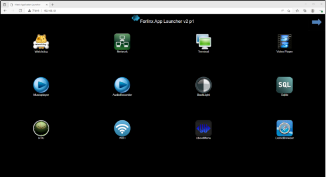

### **3.19 4G/5G Test**

OK62xx supports 4G module EM05-CE, 5G module RM500U-CN and RM500Q-GL. Take the 4G module as an example for testing. The process of the 5G module is the same as that of the 4G module, here will not repeat it. Before starting the development board, connect the 4G module (Carrier board P24 slot) and insert the SIM card to start the development board.

**Note:**

- **The 4G module needs to be connected to the antenna, and the EM05-CE has only one antenna interface;**

- **Pay attention to the insertion direction of the SIM card, the notched part of the SIM card should be in the lower left position;**

- **The 5G module needs to be connected to the antenna, and there are four antenna interfaces on the module.**

EM05-CE Module Test：

After connecting the EM05-CE module to the OK62xx platform powering up and starting up, the USB status can be viewed via the lsusb command.

```plain
root@OK62xx:~# lsusb
Bus 002 Device 001: ID 1d6b:0003 Linux Foundation 3.0 root hub
Bus 001 Device 003: ID 2c7c:0125 Quectel Wireless Solutions Co., Ltd. EC25 LTE modem
//EC25的VID和PID
Bus 001 Device 002: ID 1a40:0101 Terminus Technology Inc. Hub
Bus 001 Device 001: ID 1d6b:0002 Linux Foundation 2.0 root hub
```

Take the insertion of mobile SIM card to test 4G Internet access as an example to test whether it can connect to the external network:

```plain
root@OK62xx:~# fltest_quectel.sh &
[1] 991
[05-18_19:26:03:403] Quectel_QConnectManager_Linux_V1.6.0.24
[05-18_19:26:03:406] Find /sys/bus/usb/devices/1-1.4 idVendor=0x2c7c idProduct=0x125, bus=0x001, dev=0x003
[05-18_19:26:03:407] Auto find qmichannel = /dev/qcqmi0
[05-18_19:26:03:407] Auto find usbnet_adapter = usb0
[05-18_19:26:03:408] netcard driver = GobiNet, driver version = V1.6.2.14
[05-18_19:26:03:408] Modem works in QMI mode
root@ok6254:~# [05-18_19:26:03:460] Get clientWDS = 7
[05-18_19:26:03:492] Get clientDMS = 8
[05-18_19:26:03:524] Get clientNAS = 9
[05-18_19:26:03:556] Get clientUIM = 10
[05-18_19:26:03:588] Get clientWDA = 11
[05-18_19:26:03:620] requestBaseBandVersion EM05CEFCR06A02M1G_ND
[05-18_19:26:03:747] requestGetSIMStatusSIMStatus: SIM_READY
[05-18_19:26:03:779] requestGetProfile[1] 3gnet///0
[05-18_19:26:03:811] requestRegistrationState2 MCC: 460, MNC: 1, PS: Attached, DataCap: LTE //4G signal
[05-18_19:26:03:844] requestQueryDataCall IPv4ConnectionStatus: DISCONNECTED
[05-18_19:26:03:844] ifconfig usb0 0.0.0.0
[05-18_19:26:03:852] ifconfig usb0 down
[05-18_19:26:03:908] requestSetupDataCall WdsConnectionIPv4Handle: 0x87215460
[05-18_19:26:04:068] ifconfig usb0 up
[05-18_19:26:04:079] busyboxudhcpc -f -n -q -t 5 -i usb0
udhcpc: started, v1.31.1
udhcpc: sending discover
udhcpc: sending select for 10.120.65.31
udhcpc: lease of 10.120.65.31 obtained, lease time 7200
[05-18_19:26:04:315] /etc/udhcpc.d/50default: Adding DNS 123.123.123.123
[05-18_19:26:04:315] /etc/udhcpc.d/50default: Adding DNS 123.123.123.124
[  219.179387] IPv6: ADDRCONF(NETDEV_CHANGE): usb0: link becomes ready

```

Ping test：

```plain
root@OK62xx:~#ping www.baidu.com
PING www.baidu.com (110.242.68.3): 56 data bytes
64 bytes from 110.242.68.3: seq=0 ttl=53 time=59.293 ms
64 bytes from 110.242.68.3: seq=1 ttl=53 time=83.101 ms
64 bytes from 110.242.68.3: seq=2 ttl=53 time=65.678 ms
64 bytes from 110.242.68.3: seq=3 ttl=53 time=80.908 ms
64 bytes from 110.242.68.3: seq=4 ttl=53 time=115.297 ms
64 bytes from 110.242.68.3: seq=5 ttl=53 time=130.456 ms
64 bytes from 110.242.68.3: seq=6 ttl=53 time=447.500 ms
64 bytes from 110.242.68.3: seq=7 ttl=53 time=265.506 ms
64 bytes from 110.242.68.3: seq=8 ttl=53 time=336.629 ms
^C
--- www.baidu.com ping statistics ---
9 packets transmitted, 9 packets received, 0% packet loss
round-trip min/avg/max = 59.293/176.040/447.500 ms
```

### 3.20 DDR Bandwidth Test

```plain
root@ok62xx:~# fltest_memory_bandwidth.sh
L1 cache bandwidth rd test with # process
0.008192 16806.41
0.008192 16803.33
0.008192 16899.11
0.008192 16853.02
0.008192 16693.46
L2 cache bandwidth rd test
0.131072 7330.70
0.131072 7314.98
0.131072 7343.83
0.131072 7306.66
0.131072 7327.31
Main mem bandwidth rd test
52.43 1464.61
52.43 1468.80
52.43 1470.45
52.43 1467.16
52.43 1461.31
L1 cache bandwidth wr test with # process
0.008192 14658.67
0.008192 14663.98
0.008192 14666.66
0.008192 14666.66
0.008192 14650.68
L2 cache bandwidth wr test
0.131072 8412.49
0.131072 8454.00
0.131072 8455.47
0.131072 8419.64
0.131072 8398.09
Main mem bandwidth wr test
52.43 1025.22
52.43 1025.58
52.43 1026.45
52.43 1014.45
52.43 1019.60
```

The DDR4 bandwidth of the OK6254-C is shown in the figure above, with a read bandwidth of about 1460M/s and a write bandwidth of about 1020 M/s.

The read bandwidth of DDR4 on the OK6231/6232 - C is approximately 1280 M/s, and the write bandwidth is approximately 870 M/s.

### **3.21 SQLite3 Test**

QLite3 is a lightweight, ACID-compliant relational database management system with a low footprint. The OK62-C development board is ported with version 3.31.1 of sqlit3.

```plain
​```
root@ok62xx~/$ sqlite3
SQLite version 3.31.1 2020-01-27 19:55:54
Enter ".help" for usage hints.
Connected to a transient in-memory database.
Use ".open FILENAME" to reopen on a persistent database.

At the sqlite prompt:
sqlite> create table tbl1 (one varchar(10), two smallint);             // Create table tbl1
sqlite> insert into tbl1 values('hello!', 10);                          // Insert data 'hello!'|10 into table tbl1
sqlite> insert into tbl1 values('goodbye', 20);                      // Insert data 'goodbye'|20 into table tbl1
sqlite> select * from tbl1;                                       // Query the contents of table tbl1
hello!|10
goodbye|20
sqlite> delete from tbl1 where one = 'hello!';                       // Delete data
sqlite> select * from tbl1;                                       // Query the contents of table tbl1
goodbye|20
sqlite> .quit			                                        // Exit the database (or use the .exit command)
​``` 
```

### **3.22 Closing the Desktop**

Open or close the desktop :

```plain
root@ok62xx:~# /etc/init.d/matrix-gui-2.0 stop                      //Turn on the desktop
root@ok62xx:~# /etc/init.d/matrix-gui-2.0 start                    //Turn off the desktop
```

### **3.23 Openssl**

The OK62xx-C contains a hardware encryption acceleration module.

Acceleration module testing without hardware encryption

```plain
root@ok62xx:~# openssl speed -engine devcrypto -multi 8 -elapsed -evp aes-128-cbc
Forked child 0
engine "devcrypto" set.

+DT:aes-128-cbc:3:16
Forked child 1
engine "devcrypto" set.
Forked child 2
+DT:aes-128-cbc:3:16
engine "devcrypto" set.
Forked child 3
…….
compiler: aarch64-none-linux-gnu-gcc  --sysroot=recipe-sysroot -O2 -pipe -g -feliminate-unused-debug-types 
-fmacro-prefix-map=
-fdebug-prefix-map=                      
-fdebug-prefix-map=                      
-fdebug-prefix-map=  
-DOPENSSL_USE_NODELETE 
-DOPENSSL_PIC 
-DOPENSSL_CPUID_OBJ 
-DOPENSSL_BN_ASM_MONT 
-DSHA1_ASM 
-DSHA256_ASM 
-DSHA512_ASM 
-DKECCAK1600_ASM 
-DVPAES_ASM 
-DECP_NISTZ256_ASM 
-DPOLY1305_ASM 
-DNDEBUG
evp               4515.05k    25724.75k   199024.08k   664772.77k  2116311.82k  2443059.21k
```

Acceleration module testing with hardware encryption

```plain
root@ok62xx:~# insmod /lib/modules/`uname -r`/kernel/crypto/tcrypt.ko mode=500 sec=1 
[ 3143.525663] tcrypt:
[ 3143.525663] testing speed of async ecb(aes) (ecb-aes-ce) encryption
[ 3143.534137] tcrypt: test 0 (128 bit key, 16 byte blocks): 1832666 operations in 1 seconds (29322656 bytes)
[ 3144.543108] tcrypt: test 1 (128 bit key, 64 byte blocks): 1633381 operations in 1 seconds (104536384 bytes)
[ 3145.551184] tcrypt: test 2 (128 bit key, 256 byte blocks): 1338923 operations in 1 seconds (342764288 bytes)
[ 3146.559264] tcrypt: test 3 (128 bit key, 1024 byte blocks): 713200 operations in 1 seconds (730316800 bytes)
[ 3147.567273] tcrypt: test 4 (128 bit key, 1472 byte blocks): 571509 operations in 1 seconds (841261248 bytes)
[ 3148.575262] tcrypt: test 5 (128 bit key, 8192 byte blocks): 138192 operations in 1 seconds (1132068864 bytes)
[ 3149.583354] tcrypt: test 6 (192 bit key, 16 byte blocks): 1798271 operations in 1 seconds (28772336 bytes)
[ 3150.591092] tcrypt: test 7 (192 bit key, 64 byte blocks): 1547245 operations in 1 seconds (99023680 bytes)
[ 3151.599090] tcrypt: test 8 (192 bit key, 256 byte blocks): 1252461 operations in 1 seconds (320630016 bytes)
[ 3152.607264] tcrypt: test 9 (192 bit key, 1024 byte blocks): 624737 operations in 1 seconds (639730688 bytes)
[ 3153.615264] tcrypt: test 10 (192 bit key, 1472 byte blocks): 498968 operations in 1 seconds (734480896 bytes)
[ 3154.623346] tcrypt: test 11 (192 bit key, 8192 byte blocks): 116120 operations in 1 seconds (951255040 bytes)
[ 3155.631350] tcrypt: test 12 (256 bit key, 16 byte blocks): 1781781 operations in 1 seconds (28508496 bytes)
[ 3156.639174] tcrypt: test 13 (256 bit key, 64 byte blocks): 1516794 operations in 1 seconds (97074816 bytes)
[ 3157.647173] tcrypt: test 14 (256 bit key, 256 byte blocks): 1226219 operations in 1 seconds (313912064 bytes)
[ 3158.655346] tcrypt: test 15 (256 bit key, 1024 byte blocks): 601944 operations in 1 seconds (616390656 bytes)
[ 3159.663362] tcrypt: test 16 (256 bit key, 1472 byte blocks): 479289 operations in 1 seconds (705513408 bytes)
[ 3160.671344] tcrypt: test 17 (256 bit key, 8192 byte blocks): 110555 operations in 1 seconds (905666560 bytes)
…
[  592.973938] tcrypt: test 17 (288 bit key, 8192 byte blocks): 84755 operations in 1 seconds (694312960 bytes)
[ 1151.831378] tcrypt: failed to load transform for ofb(aes): -2
[ 1151.848319] tcrypt: failed to load transform for ofb(aes): -2 This error does not affect
```

### **3.23 JVM**

OK62xx-C supports java1.8.

Path: OK62xx-C（Linux）User Profile\Tool\jdk-8u321-linux-aarch64.tar.gz

Copy the disc jdk-8u321-linux-aarch64. tar. gz file to the OK62xx-C board and extract it to the/usr/local/directory

```plain
root@ok62xx:~# export PATH=$PATH:/usr/local/jdk1.8.0_321/bin
root@ok62xx:~# java -version
java version "1.8.0_321"
Java(TM) SE Runtime Environment (build 1.8.0_321-b07)
Java HotSpot(TM) 64-Bit Server VM (build 25.321-b07, mixed mode)
```

### **3.24 Docker**

Docker is an open platform for developing, delivering, and running applications. OK62xx-C has installed and booted Docker, and you can directly use commands to obtain images and operate containers. The basic operations of docker are briefly listed below. (Please set the system time to the current time before use)

#### **3.24.1 Retrieving and Listing of Images**

To obtain the Ubuntu 18.04 image, you can use the following command:

```plain
root@ok62xx:~# docker pull ubuntu:18.04
18.04: Pulling from library/ubuntu
e196da37f904: Pull complete
Digest: sha256:d21b6ba9e19feffa328cb3864316e6918e30acfd55e285b5d3df1d8ca3c7fd3f
Status: Downloaded newer image for ubuntu:18.04
docker.io/library/ubuntu:18.04
```

You can use the following command to list the images and see the Ubuntu 18.04 images that you obtained earlier

```plain
root@ok62xx:~# docker image ls
REPOSITORY     TAG              IMAGE ID            CREATED               SIZE
ubuntu            latest            f3d495355b4e        Less than a second ago   69.2MB
ubuntu            18.04            cc6f13ca5102        Less than a second ago   56.7MB
hello-world        latest              46331d942d63       Less than a second ago   9.14kB
```

#### **3.24.2 Starting a Container**

The following command launches a bash terminal, allowing the user to interact.

```plain
root@ok62xx:~# docker run -t -i ubuntu:18.04 /bin/bash
[  880.955469] docker0: port 1(vethcdccd16) entered blocking state
[  880.961664] docker0: port 1(vethcdccd16) entered disabled state
[  880.968389] device vethcdccd16 entered promiscuous mode
[  883.429995] eth0: renamed from veth9158404
[  883.456492] IPv6: ADDRCONF(NETDEV_CHANGE): vethcdccd16: link becomes ready
[  883.463641] docker0: port 1(vethcdccd16) entered blocking state
[  883.469610] docker0: port 1(vethcdccd16) entered forwarding state
root@019a0f8acd41:/#
```

Once inside the container, we can operate under the Shell and execute any necessary commands. Here, cat etc/os-release is executed, which is a common command for Linux to view the current system version. From the returned result, you can see that the container is Ubuntu 18.04.1 LTS system. Finally, exit the container via the command "exit".

For more information about the operation and use of docker, please refer to the official docker tutorial: https://docs.docker.com/get-started/overview/

### **3.25 GPIO Test**

On the OK62xx-C carrier board, GPIO pins are led out at R51 - R55 and connected to LED. According to the pin names marked in the schematic diagram, use the sysfs method to control the GPIO. Set the output level (high or low) of the GPIO to control the on and off of the LED.


Because gpio1 \_ 16-19 has been occupied by the led driver, change the status of LEDs in the OK62xx-C. dts to status = "disabled", and then compile the replacement device tree before the following test GPIOs are divided into three groups, namely, MCU \_ GPIO, GPIO0 and GPIO1, where the MCU \_ GPIO is the M-core resource, and the GPIO number is calculated according to the following table rule:

| mcu_gpio | 0+x   |
| -------- | ----- |
| GPIO0_X  | 24+x  |
| GPIO1_X  | 116+x |

If GPIO1 \_ 16 belongs to GPIO1, then 116 + 16 = 132, and the GPIO number is 132.

```plain
​```
root@ok62xx:~# 
root@ok62xx:~# fltest_gpio.sh 132 0                      // Set the GPIO to output a low level to turn off the LED
===GPIO1_16===0
root@ok62xx:~# fltest_gpio.sh 132 1                      // Set the GPIO to output a high level to turn on the LED
===GPIO1_16===1
root@ok62xx:~# 
root@ok62xx:~# fltest_gpio.sh 133 0                      // Set the GPIO to output a low level to turn off the LED
===GPIO1_17===0
root@ok62xx:~# fltest_gpio.sh 133 1                      // Set the GPIO to output a high level to turn on the LED
===GPIO1_17===1
​```
```

## 4. Development Board Interface Function Test

Based on the official BSP, Forlinx has done a lot of optimization on the display. The OK62xx-C platform has perfect support for display and can excel in the high-performance characteristics of the combination of architecture and proprietary acceleration hardware.

QT test program source code path: user profile / Linux / source code / OK62xx-linux-sdk.tar.bz2 decompressed: OK62xx-linux-sdk/appsrc/forlinx-qt

The Qt routines provided by Forlinx are mainly for hardware interface call reference; Qt components, special effects, etc. are recommended to refer to the official Qt routines.

Path to the test program in the development board file system: /usr/bin/fltest\_qt\_\*

### **4.1 Introduction to Interface Function**

The desktop is displayed as follows after the board is booted:</font>

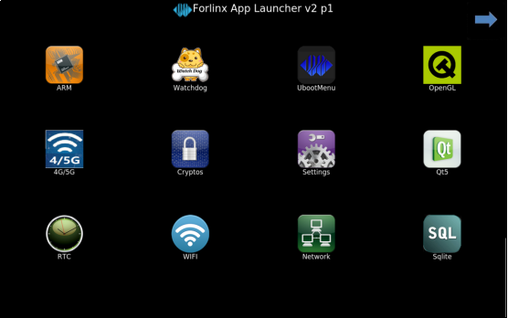

### **4.2 OpenGL Test**

OK 6232 and OK 6231 have no GPU and do not support OpenGL. Skip this section. OK6254 supports OpenGLES 1.1, 2.0, 3.0, 3.1 and 3.2; click on the desktop "OpenGL" icon to test it.


Click the "Exit" button to exit the test.

### **4.3 Music Play Test**

"Musicplayer" is a simple audio test application that can be used to test if the sound card is functioning properly or as a simple audio player with the following interface:

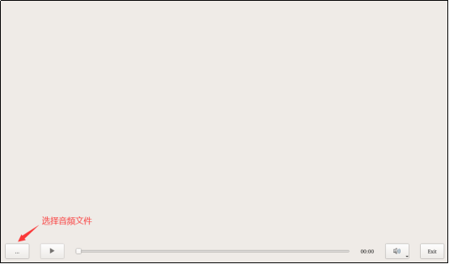

Click the button in the lower left corner and select test audio /home/forlinx/audio/test.mp3

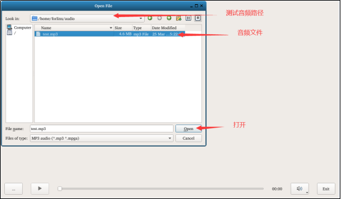


**Note: The current version of the music player does not support pause and skip.**

### **4.4 4G/5G Test**

The "4G/5G " test program is used to test the OK62xx external 4G module (EM05-CE) and 5G module (RM500Q-GL,RM500U-CN). Before testing, please power off the development board, access the external module, insert the SIM card, and start the development board to open the test application.

Click the connect button, the program will automatically enter the dial-up process and get IP to set DNS, etc.

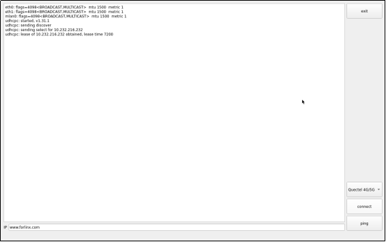

**Note: The application temporarily shuts down Ethernet, WIFI, and other nodes before performing the ping test. If multiple gateways are turned on simultaneously, the ping test is not necessarily performed with a 4G/5G NIC.**

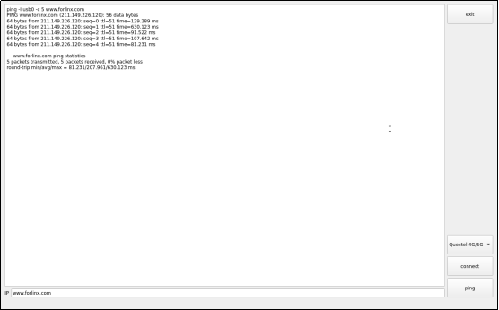

Click the "Exit" button to exit the test.

### **4.5 WIFI Test**

"WIFI" is a tool to configure WiFi and test the STA mode of wifi.

WiFi module will exist as mlan node in the system, here test mlan0 as an example, the application interface is as follows:

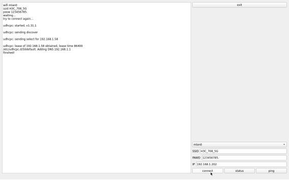

<font style="color:rgb(0,0,0);"> </font>

Select mlan0, enter the name of the router to be connected by WiFi in the SSID column, enter the password of the router in the PAWD column, and click Connect to connect the router through wifi.

The current connection status can be displayed by clicking the STATUS button as follows:


After the connection is successful, click ping to test the network, enter the IP to be pinged in the IP column, and click ping, as shown below:


### **4.6 Network Configuration Test**

**Note: The information such as IP set in STATIC mode will be saved in the relevant configuration file of the system, so the network information set this time will be used every time the system is restarted; however, the network information configured in DHCP mode does not need to pay attention to this point, and the IP address will be dynamically allocated every time the system is restarted.**

When Ok62xx starting, the network card is set to DHCP by default, and DHCP and STATIC modes can be selected through the "Network" network configuration application. STATIC mode configures IP address, subnet mask, gateway, DNS.

The DHCP mode interface is as follows:


Select DHCP, select the network card device to be configured in the interface, and click the Apply and Restart Network at the bottom of the interface to restart the network and automatically obtain the IP address.

The STATIC mode interface is as follows:


Select the network card device to be configured in the interface, enter the IP to be set in the IP column, enter the subnet mask in the netmask column, enter the gateway in the getway column, and enter the DNS in the DNS column. After the above contents are filled, click the Apply and Restart Network at the bottom of the interface to configure the static IP according to the above settings

### **4.7 Ping Test**

"Ping ()" is the interface version application of the common network test command ping, and the interface is as follows:


Write the target IP to be pinged in the hostname column. After clicking the ping key, the result column will prompt the result of the ping. As shown in the figure, it indicates that the network is smooth. Click Stop to stop the ping test, and click Clear to clear the information in result.

### **4.8 Watchdog Test**

“WatchDog” is an application used to test whether the watchdog function is normal or not, the interface is as follows:

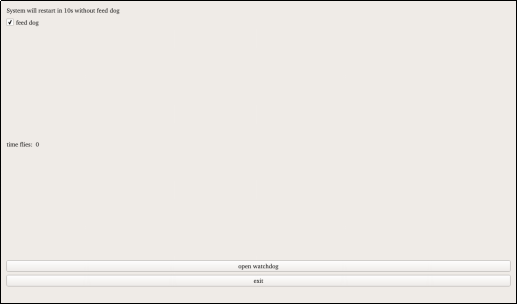

Check "feed dog" and click the "open watchdog" button. At this time, the watchdog function will be started, and the program will feed the dog. Under normal circumstances, the system will not restart. Click the "close watchdog" button. At this time, the program will stop feeding the dog, but will not stop the watchdog. The system will restart after 10 seconds.

When unchecking the feed dog, click the open watchdog button, the watchdog function will be started, and the program will not feed the dog. After opening the watchdog for about 10 seconds, the system will restart, indicating that the watchdog function is normal.

**Note: The watchdog in OK62 does not support dog stop operation.**

### **4.9 RTC Test**

"RTC" is the software used to test the real-time clock of the system. You can view and set the current system time. Click Set on the interface to set the time. After setting, click Save to complete the setting. With the RTC backup battery installed, you can restart the board to confirm that the RTC clock is set successfully.

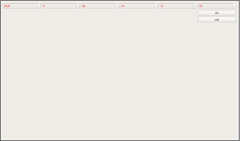

### **4.10 Serial Port Test**

“Terminal” is a serial port test routine officially provided by Qt, which can be used to test the OK 62xx on-board serial port. Take the serial port 1 of the test development board as an example for demonstration.

Because the serial port 1 is set as the 485 bus standard, the on-board serial port 1 of OK62xx needs to be connected to the USB to 485 module for testing.

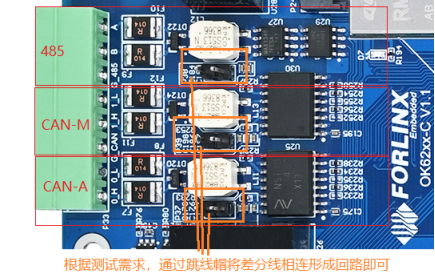

After the connection is complete, open Terminal, open the serial debugging tool from the PC side .

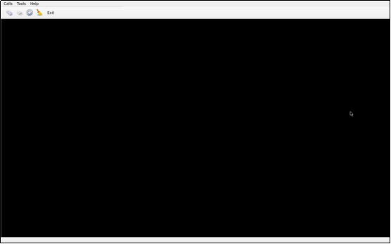


Click "Terminal" to set according to the following steps. Because ttyS3 corresponds to serial port 1, select ttyS3 in the following figure:


When the settings are complete, click Apply.

Click Settings on the main interface to open the serial port.

PC-side serial port tool setup parameters and the above figure are the same, select USB to 485, the corresponding serial port number, and open the serial port. Click the Send button to send data

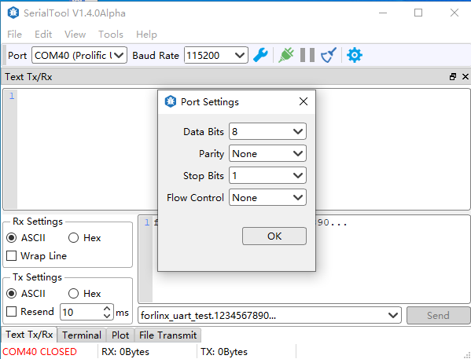

At this time, the terminal receives the transmitted information

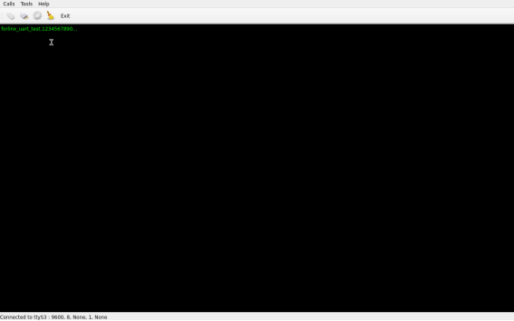

Click on the black form to bring up the virtual keyboard and enter characters. For example, enter forlinx, and the PC serial port tool will also receive the corresponding content.

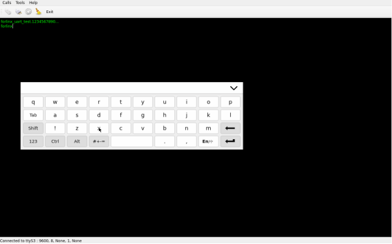

<font style="color:rgb(0,0,0);"> </font>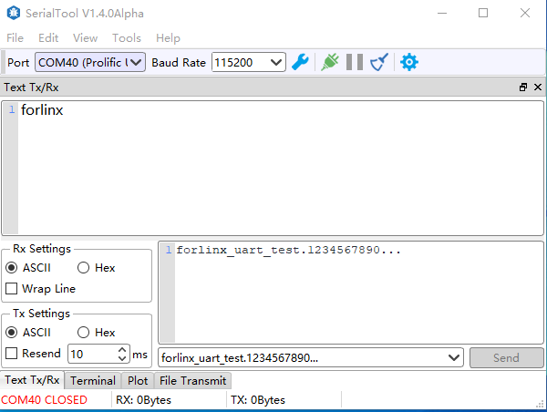

After the test, click "Exit" to exit the program.

### **4.11 Backlight Test**

“BackLight” is the LCD backlight adjustment application. Click to open the interface as follows:


Drag the slider in the interface to set the LCD backlight brightness. Level 0 is no backlight, and level 255 is the highest brightness.

### **4.12 Database Test**

Click the icon "SQL" to enter the database test interface, and you can see the sample program books that Qt uses SQLite.

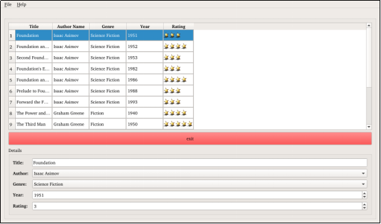

### **4.13 UBOOT Menu Configuration Settings**

Click the UbootMenu to enter the UBOOT menu configuration interface for testing.

In the UBOOT menu configuration test program, LCD screen resolution, LVDS screen resolution, single and double screen, display mode, etc. can be configured.

The display screen configuration interface is as follows:

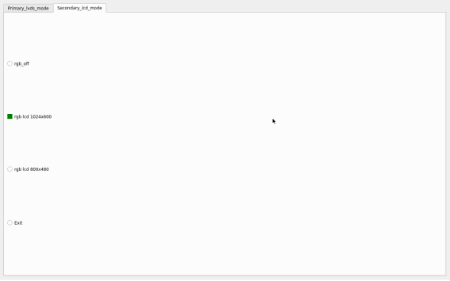

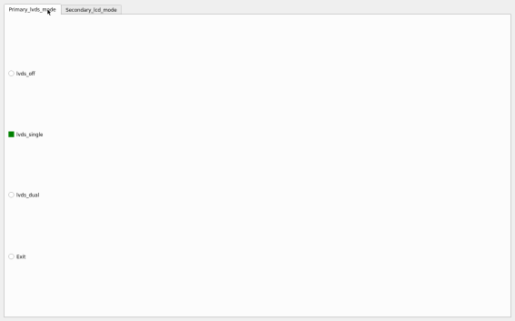

When LVDS is set, the desktop is displayed on LVDS first After configuration, click Exit to exit, and the configuration will take effect after restart.

### **4.14 Chinese Input Test**

Click the "English" to enter the Chinese input test interface.

The test interface is as follows:

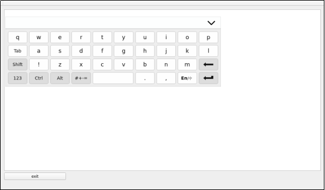

<font style="color:rgb(0,0,0);">Click the button</font><font style="color:rgb(0,0,0);">to the switch the input mode.</font>

Input Chinese, and the display is as follows:

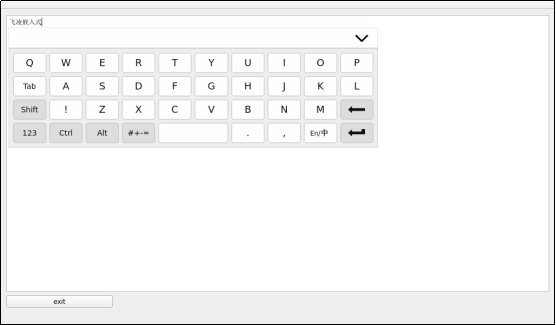

After the test, click the exit button in the lower left corner to exit.

**Note: The soft keyboard for the OK6254 platform version appears fixed in the upper left corner and cannot be dragged at this time.**

### **4.15 TI Test**

<font style="color:rgb(0,0,0);">TI officially provides some test programs, including ARM, (</font><font style="color:rgb(0,0,0);">), Settings(</font><font style="color:rgb(0,0,0);">), USB(</font><font style="color:rgb(0,0,0);">), Qt5(</font><font style="color:rgb(0,0,0);">), Crytos(</font>) Click on the test program, there will be an interface with the test program instructions and test purpose.

Click the "RUN" button on the instruction screen to start the test.

**Note: NBench and USB Bonnie will last for several minutes in the TI test. Please read the test instructions and precautions in the test interface first. After the test, the exit key will appear to return to the desktop.**

### **4.16 Camera Test**

Click the “Camera” ( ) on the desktop to test.

Click camera video to select the camera device.

**Note: When there is no MIPI camera, the corresponding device of UVC camera is/dev/video0. When there are both mipi camera and USB camera, the corresponding device is/dev/video4. Please select the corresponding device according to the actual situation.**


<font style="color:rgb(0,0,0);">Click camera resolution to select the resolution.</font>

After setting the device and resolution, click Start to start the preview


Click picture to take a picture, and the picture will be saved in the/home/root/directory.

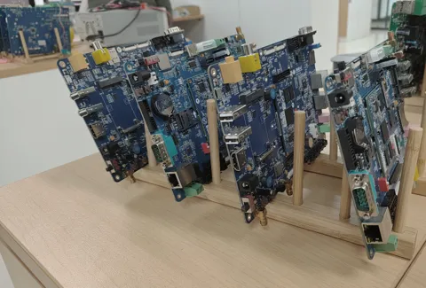

**Note: The photo taking function can only be activated after starting the preview.**

Click Stop to stop it.

There is a delay with the OV5645 preview due to the software decoding used by the QT application.

## 5. Development Board Multimedia Test

### **5.1 Camera Test**

The OK62xx -C supports the OV5645 MIPI camera as well as the UVC camera. First, let’s test the UVC webcam by plugging in the USB camera into the development board. It will automatically install UVC and add the device node.

#### **5.1.1 UVC Camera Test**

Check whether the UVC Camera device node is identified, as shown in the following figure/dev/video0 node:

```plain
root@ok62xx:~#v4l2-ctl --list-devices
[ 89.769397] usb 1-1.1: reset high-speed USB device number 5 using xhci-hcd
Video Capture 5 (usb-xhci-hcd.0.auto-1.1):
/dev/video0
/dev/video1
/dev/media0
```

View the formats and resolutions supported by the camera:

```plain
root@ok62xx:~#v4l2-ctl --list-formats-ext -d /dev/video0
ioctl: VIDIOC_ENUM_FMT
Type: Video Capture

[0]: 'MJPG' (Motion-JPEG, compressed)
Size: Discrete 1280x720
Interval: Discrete 0.033s (30.000 fps)
Interval: Discrete 0.033s (30.000 fps)
Size: Discrete 160x120
Interval: Discrete 0.033s (30.000 fps)
Size: Discrete 176x144
Interval: Discrete 0.033s (30.000 fps)
Size: Discrete 320x240
Interval: Discrete 0.033s (30.000 fps)
Size: Discrete 352x288
Interval: Discrete 0.033s (30.000 fps)
Size: Discrete 424x240
Interval: Discrete 0.033s (30.000 fps)
Size: Discrete 640x360
Interval: Discrete 0.033s (30.000 fps)
Size: Discrete 960x540
Interval: Discrete 0.033s (30.000 fps)
Size: Discrete 1280x720
Interval: Discrete 0.033s (30.000 fps)
Interval: Discrete 0.033s (30.000 fps)
Size: Discrete 640x480
Interval: Discrete 0.033s (30.000 fps)
Size: Discrete 800x600
Interval: Discrete 0.033s (30.000 fps)
[1]: 'YUYV' (YUYV 4:2:2)
Size: Discrete 640x480
Interval: Discrete 0.033s (30.000 fps)
Size: Discrete 160x120
Interval: Discrete 0.033s (30.000 fps)
Size: Discrete 176x144
Interval: Discrete 0.033s (30.000 fps)
Size: Discrete 320x240
Interval: Discrete 0.033s (30.000 fps)
Size: Discrete 352x288
Interval: Discrete 0.033s (30.000 fps)
Size: Discrete 424x240
Interval: Discrete 0.033s (30.000 fps)
Size: Discrete 640x360
Interval: Discrete 0.033s (30.000 fps)
Size: Discrete 960x540
Interval: Discrete 0.100s (10.000 fps)
Size: Discrete 1280x720
Interval: Discrete 0.100s (10.000 fps)
Size: Discrete 800x600
Interval: Discrete 0.100s (10.000 fps)
```

1\. Camera preview:

**Note: OK6232 and OK6231 do not support gst-launch-1.0. OK6254 can be tested with the following commands.**

```plain
root@ok62xx:~# gst-launch-1.0 v4l2src device=/dev/video0 io-mode=2 ! video/x-raw,format=YUY2,width=640,height=480,framerate=30/1 ! waylandsink 
[ 183.497378] usb 1-1.1: reset high-speed USB device number 5 using xhci-hcd
Setting pipeline to PAUSED ...
Pipeline is live and does not need PREROLL ...
Setting pipeline to PLAYING ...
New clock: GstSystemClock
```

You can see a preview of the camera on the screen.

2\. Camera to take pictures

```plain
root@ok62xx:~# gst-launch-1.0 v4l2src device=/dev/video0 io-mode=2 num-buffers=10 ! video/x-raw,format=YUY2,width=640,height=480,framerate=30/1 ! jpegenc ! filesink location=pic.jpeg
Setting pipeline to PAUSED ...
Pipeline is live and does not need PREROLL ...
Setting pipeline to PLAYING ...
New clock: GstSystemClock
Got EOS from element "pipeline0".
Execution ended after 0:00:01.529502584
Setting pipeline to NULL ...
Freeing pipeline ...
root@ok62xx:~#ls
pic.jpeg
```

Then copy the pic. jpeg to Windows and open it to see the photos taken.

#### **5.1.2 OV5645 Camera Test**

The test method of OV5645 is basically the same as that of UVC Camera. First, confirm the device node of the OV5645.

```plain
root@OK62xx:~# v4l2-ctl --list-devices
j721e-csi2rx (platform:30102000.ticsi2rx):
/dev/video0
/dev/video1
/dev/video2
/dev/video3
/dev/media0
```

View the formats and resolutions supported by the camera:

```plain
root@OK62xx:~# v4l2-ctl --list-formats-ext -d /dev/video0
ioctl: VIDIOC_ENUM_FMT
Type: Video Capture

[0]: 'YUYV' (YUYV 4:2:2)
Size: Stepwise 8x1 - 8192x16384 with step 8/1
[1]: 'UYVY' (UYVY 4:2:2)
Size: Discrete 640x480
Size: Discrete 1280x960
Size: Discrete 1920x1080
Size: Discrete 2592x1944
[2]: 'YVYU' (YVYU 4:2:2)
Size: Stepwise 8x1 - 8192x16384 with step 8/1
[3]: 'VYUY' (VYUY 4:2:2)
Size: Stepwise 8x1 - 8192x16384 with step 8/1
[4]: 'BA81' (8-bit Bayer BGBG/GRGR)
Size: Stepwise 16x1 - 16384x16384 with step 16/1
[5]: 'GBRG' (8-bit Bayer GBGB/RGRG)
Size: Stepwise 16x1 - 16384x16384 with step 16/1
[6]: 'GRBG' (8-bit Bayer GRGR/BGBG)
Size: Stepwise 16x1 - 16384x16384 with step 16/1
[7]: 'RGGB' (8-bit Bayer RGRG/GBGB)
Size: Stepwise 16x1 - 16384x16384 with step 16/1
[8]: 'BG10' (10-bit Bayer BGBG/GRGR)
Size: Stepwise 8x1 - 8192x16384 with step 8/1
[9]: 'GB10' (10-bit Bayer GBGB/RGRG)
Size: Stepwise 8x1 - 8192x16384 with step 8/1
[10]: 'BA10' (10-bit Bayer GRGR/BGBG)
Size: Stepwise 8x1 - 8192x16384 with step 8/1
[11]: 'RG10' (10-bit Bayer RGRG/GBGB)
Size: Stepwise 8x1 - 8192x16384 with step 8/1
[12]: 'BG12' (12-bit Bayer BGBG/GRGR)
Size: Stepwise 8x1 - 8192x16384 with step 8/1
[13]: 'GB12' (12-bit Bayer GBGB/RGRG)
Size: Stepwise 8x1 - 8192x16384 with step 8/1
[14]: 'BA12' (12-bit Bayer GRGR/BGBG)
Size: Stepwise 8x1 - 8192x16384 with step 8/1
[15]: 'RG12' (12-bit Bayer RGRG/GBGB)
Size: Stepwise 8x1 - 8192x16384 with step 8/1
[16]: 'RGI0' (10-bit Bayer RGBG/GIrGIr)
Size: Stepwise 8x1 - 8192x16384 with step 8/1
[17]: 'GRI0' (10-bit Bayer GRGB/IrGIrG)
Size: Stepwise 8x1 - 8192x16384 with step 8/1
[18]: 'BGI0' (10-bit Bayer BGRG/GIrGIr)
Size: Stepwise 8x1 - 8192x16384 with step 8/1
[19]: 'GBI0' (10-bit Bayer GBGR/IrGIrG)
Size: Stepwise 8x1 - 8192x16384 with step 8/1
[20]: 'GIR0' (10-bit Bayer GIrGIr/RGBG)
Size: Stepwise 8x1 - 8192x16384 with step 8/1
[21]: 'IGR0' (10-bit Bayer IrGIrG/GRGB)
Size: Stepwise 8x1 - 8192x16384 with step 8/1
[22]: 'GIB0' (10-bit Bayer GIrGIr/BGRG)
Size: Stepwise 8x1 - 8192x16384 with step 8/1
[23]: 'IGB0' (10-bit Bayer IrGIrG/GBGR)
Size: Stepwise 8x1 - 8192x16384 with step 8/1
```

**Note: The OV5645 currently only supports the UYVY format and supports four resolutions. The other formats listed in the table are those supported by the mipi-csi controller.**

1\. Camera preview:

**Note: OK6232 and OK6231 do not support gst-launch-1.0. OK6254 can be tested with the following commands.**

```plain
root@OK62xx:~# gst-launch-1.0 v4l2src device=/dev/video0 io-mode=2 ! video/x-raw,format=YUY2,width=640,height=480,framerate=15/1 ! waylandsink -e
Setting pipeline to PAUSED ...
Pipeline is live and does not need PREROLL ...
Pipeline is PREROLLED ...
Setting pipeline to PLAYING ...
New clock: GstSystemClock
Redistribute latency...
```

Switch the camera resolution and use the media controller to view the current resolution and format as follows:

```plain
root@OK62xx:~# media-ctl -p
Media controller API version 6.1.33

Media device information
------------------------
driver          j721e-csi2rx
model           TI-CSI2RX
serial
bus info        platform:30102000.ticsi2rx
hw revision     0x1
driver version  6.1.33

Device topology
- entity 1: 30102000.ticsi2rx (5 pads, 5 links, 1 route)
type V4L2 subdev subtype Unknown flags 0
device node name /dev/v4l-subdev0
routes:
0/0 -> 1/0 [ACTIVE]
pad0: Sink
[stream:0 fmt:UYVY8_2X8/640x480 field:none colorspace:srgb xfer:srgb ycbcr:601 quantization:lim-range]
<- "cdns_csi2rx.30101000.csi-bridge":1 [ENABLED,IMMUTABLE]
pad1: Source
[stream:0 fmt:UYVY8_2X8/640x480 field:none colorspace:srgb xfer:srgb ycbcr:601 quantization:lim-range]
-> "30102000.ticsi2rx context 0":0 [ENABLED,IMMUTABLE]
pad2: Source
-> "30102000.ticsi2rx context 1":0 [ENABLED,IMMUTABLE]
pad3: Source
-> "30102000.ticsi2rx context 2":0 [ENABLED,IMMUTABLE]
pad4: Source
-> "30102000.ticsi2rx context 3":0 [ENABLED,IMMUTABLE]

- entity 7: cdns_csi2rx.30101000.csi-bridge (5 pads, 2 links, 1 route)
type V4L2 subdev subtype Unknown flags 0
device node name /dev/v4l-subdev1
routes:
0/0 -> 1/0 [ACTIVE]
pad0: Sink
[stream:0 fmt:UYVY8_2X8/640x480 field:none colorspace:srgb xfer:srgb ycbcr:601 quantization:lim-range]
<- "ov5645 2-003c":0 [ENABLED,IMMUTABLE]
pad1: Source
[stream:0 fmt:UYVY8_2X8/640x480 field:none colorspace:srgb xfer:srgb ycbcr:601 quantization:lim-range]
-> "30102000.ticsi2rx":0 [ENABLED,IMMUTABLE]
pad2: Source
pad3: Source
pad4: Source

- entity 13: ov5645 2-003c (1 pad, 1 link, 0 route)
type V4L2 subdev subtype Sensor flags 0
device node name /dev/v4l-subdev2
pad0: Source
[stream:0 fmt:UYVY8_2X8/640x480 field:none colorspace:srgb xfer:srgb ycbcr:601 quantization:lim-range
crop:(0,0)/0x0]
-> "cdns_csi2rx.30101000.csi-bridge":0 [ENABLED,IMMUTABLE]

- entity 19: 30102000.ticsi2rx context 0 (1 pad, 1 link, 0 route)
type Node subtype V4L flags 0
device node name /dev/video0
pad0: Sink
<- "30102000.ticsi2rx":1 [ENABLED,IMMUTABLE]

- entity 25: 30102000.ticsi2rx context 1 (1 pad, 1 link, 0 route)
type Node subtype V4L flags 0
device node name /dev/video1
pad0: Sink
<- "30102000.ticsi2rx":2 [ENABLED,IMMUTABLE]

- entity 31: 30102000.ticsi2rx context 2 (1 pad, 1 link, 0 route)
type Node subtype V4L flags 0
device node name /dev/video2
pad0: Sink
<- "30102000.ticsi2rx":3 [ENABLED,IMMUTABLE]

- entity 37: 30102000.ticsi2rx context 3 (1 pad, 1 link, 0 route)
type Node subtype V4L flags 0
device node name /dev/video3
pad0: Sink
<- "30102000.ticsi2rx":4 [ENABLED,IMMUTABLE]
```

For example, set the resolution to 1280x960:

```plain
root@OK62xx:~# media-ctl --set-v4l2 '"30102000.ticsi2rx":0/0 [fmt:UYVY8_2X8/1280x960 field:none colorspace:srgb xfer:srgb ycbcr:601 quantization:lim-range]'

root@OK62xx:~# media-ctl --set-v4l2 '"cdns_csi2rx.30101000.csi-bridge":0/0 [fmt:UYVY8_2X8/1280x960 field:none colorspace:srgb xfer:srgb ycbcr:601 quantization:lim-range]'

root@OK62xx:~# media-ctl --set-v4l2 '"ov5645 2-003c":0 [fmt:UYVY8_2X8/1280x960 field:none colorspace:srgb xfer:srgb ycbcr:601 quantization:lim-range]'
```

**Note: The resolution size of the gst-launch preview must be exactly the same as the resolution size and format of the media controller, otherwise it will be displayed incorrectly or not displayed.** **That is, ov56452-003c, csi-bridge, ticsi2rx, and gst-launch have the same format.**

2\. Camera to Take Pictures：

```plain
root@OK62xx:~# gst-launch-1.0 -v v4l2src device=/dev/video0 io-mode=2 num-buffers=10 ! video/x-raw,format=YUY2,width=640,height=480,framerate=15/1 ! jpegenc ! multifilesink location=pic%d.jpg
Setting pipeline to PAUSED ...
Pipeline is live and does not need PREROLL ...
Pipeline is PREROLLED ...
Setting pipeline to PLAYING ...
New clock: GstSystemClock
/GstPipeline:pipeline0/GstV4l2Src:v4l2src0.GstPad:src: caps = video/x-raw, format=(string)YUY2, width=(int)640, height=(int)480, framerate=(fraction)15/1, interlace-mode=(string)progressive, colorimetry=(string)2:4:16:1
/GstPipeline:pipeline0/GstCapsFilter:capsfilter0.GstPad:src: caps = video/x-raw, format=(string)YUY2, width=(int)640, height=(int)480, framerate=(fraction)15/1, interlace-mode=(string)progressive, colorimetry=(string)2:4:16:1
/GstPipeline:pipeline0/GstJpegEnc:jpegenc0.GstPad:sink: caps = video/x-raw, format=(string)YUY2, width=(int)640, height=(int)480, framerate=(fraction)15/1, interlace-mode=(string)progressive, colorimetry=(string)2:4:16:1
/GstPipeline:pipeline0/GstCapsFilter:capsfilter0.GstPad:sink: caps = video/x-raw, format=(string)YUY2, width=(int)640, height=(int)480, framerate=(fraction)15/1, interlace-mode=(string)progressive, colorimetry=(string)2:4:16:1
/GstPipeline:pipeline0/GstJpegEnc:jpegenc0.GstPad:src: caps = image/jpeg, sof-marker=(int)0, width=(int)640, height=(int)480, pixel-aspect-ratio=(fraction)1/1, framerate=(fraction)15/1, interlace-mode=(string)progressive, colorimetry=(string)2:4:16:1
/GstPipeline:pipeline0/GstMultiFileSink:multifilesink0.GstPad:sink: caps = image/jpeg, sof-marker=(int)0, width=(int)640, height=(int)480, pixel-aspect-ratio=(fraction)1/1, framerate=(fraction)15/1, interlace-mode=(string)progressive, colorimetry=(string)2:4:16:1
Redistribute latency...
Got EOS from element "pipeline0".
Execution ended after 0:00:01.765604189
Setting pipeline to NULL ...
Freeing pipeline ...
root@ok62xx:~#ls
pic0.jpg  pic2.jpg  pic4.jpg  pic6.jpg  pic8.jpg
pic1.jpg  pic3.jpg  pic5.jpg  pic7.jpg  pic9.jpg
```

**Note: The OV5645 starts slowly, and the first frame of the camera has not yet been output when the picture is taken, so the first frame of the picture may be black screen.**

Copy the picx. jpg to Windows and open it to see the photos taken.

### 5.2 Play**/Record Test**

Compatible with NAU88C22 and ES8388 audio chips, before the playback recording test, please insert the prepared earphone into the earphone interface, and use the following command to test:

#### **5.2.1 Audio Playback**

```plain
root@ok62xx:~# aplay –l                                   // List all available audio devices
**** List of PLAYBACK Hardware Devices ****
card 0: OK6254 [OK6254], device 0: davinci-mcasp.0-nau8822-hifi nau8822-hifi-0 [davinci-mcasp.0-nau8822-hifi nau8822-hifi-0]
Subdevices: 1/1
Subdevice #0: subdevice #0
root@ok62xx:~# gst-play-1.0 /home/forlinx/audio/test.mp3         // Play an audio file
Press 'k' to see a list of keyboard shortcuts.
Now playing /home/forlinx/audio/test.mp3
[  326.477740] davinci-mcasp 2b00000.audio-controller: Sample-rate is off by 400 PPM
Redistribute latency...
Redistribute latency...
0:00:09.3 / 0:05:00.0
```

### **5.2.2 Record Test**

```plain
root@ok62xx:~# aplay –l                                   // List all available audio devices
**** List of PLAYBACK Hardware Devices ****
card 0: OK6254 [OK6254], device 0: davinci-mcasp.0-nau8822-hifi nau8822-hifi-0 [davinci-mcasp.0-nau8822-hifi nau8822-hifi-0]
Subdevices: 1/1
Subdevice #0: subdevice #0
root@ok62xx:~# arecord -c 2 -r 44100 -f cd -d 5 mic.wav       // Recording command 
Recording WAVE 'mic.wav' : [  602.309408] davinci-mcasp 2b00000.audio-controller: Sample-rate is off by 400 PPM
Signed 16 bit Little Endian, Rate 44100 Hz, Stereo
root@ok62xx:~# aplay mic.wav                             // Play the generated recording file    
Playing WAVE 'mic.wav' : [  469.511369] davinci-mcasp 2b00000.audio-controller: Sample-rate is off by 400 PPM
Signed 16 bit Little Endian, Rate 44100 Hz, Stereo
```

## 6. Development Board System Flashing

### 6.1 Making and Using TF Card for Flashing

#### 6.1.1 Making TF Card for Flashing

1\. The OK62xx-C platform supports TF card flashing. First, you need to make a TF card for flashing.

(1) Use TF cards with a capacity of more than 8g and less than 32g

Copy the Ok62xx-linux-sdk/tools/bin/mksdboot. sh to the/usr/bin directory in the PC virtual machine. Connect the TF card to the PC through the card reader, format the TF card into FAT32 format on the PC side, and then mount the TF card to the virtual machine. After the virtual machine recognizes the TF card, execute the mksdboot. sh to format the TF card according to the prompt content.

```plain
Availible Drives to write images to: 

#  major   minor    size   name 
1:   8       16    7761920 sdb

Enter Device Number: 1   //Input 1

sdb

sdb was selected

Checking the device is unmounted
unmounting device '/dev/sdb1'
Would you like to re-partition the drive anyways [y/n] : y     //Input y

Now partitioning sdb ...
```

2\. Use a TF card with a capacity of more than 32g to write. You need to use the \\ OK62xx-C \_ linux6.1.33 + Qt5.14.2 \_ User Data \\ Tool \\ DiskGenius \\ DiskGenius. Exe to format. The specific steps are as follows

① Insert the memory card into the WIN10 computer;

②Open DiskGenius.exe;

③Searching TF card;

④Right-click the TF card disk to format the current partition;

⑤ Select FAT32 as the file system type and 16KB as the cluster size, and click Format.

3\. Copy the Image, ramdisk.img.gz, tiboot3.bin, ok62xx - linux - fs.sdcard.a\*, and OK62xx - C.dtb (Note: copy the device tree file corresponding to the SoM model. For example, if it’s a 6254 SoM, copy OK6254 - C.dtb) from the “OK62xx - C (linux) User Materials\\Linux\\Image Directory” to the TF card. Also, copy the tispl.bin, u - boot.img, and tiboot3.bin images from the “OK62xx - C (linux) User Materials\\2 - Images and Source Codes\\0 - Image Files\\a53” directory to the TF card. (Note: these three files are uboot image files, and the corresponding source codes are not open - source. You can only use the images provided by Forlinx for flashing.)

The above images can also be replaced with the images with the same names compiled by yourself in the OK62xx-linux-sdk/images directory.

#### 6.1.2 TF Card Flashing Test

1\. Set the OK62xx DIP switch to the SD card boot mode, insert the flashed TF card, and power on the device.

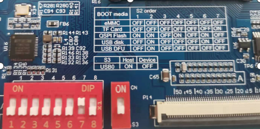

2\. When the TF card is inserted, the system will default to loading the ramdisk.img.gz and kernel image from the TF card and start through the virtual file system. After the ramdisk startup is completed, the file system OK62xx - linux - fs.sdcard.a\* will be automatically flashed to the eMMC.

3\. During the flashing process, the SoM LED3 will change from a heartbeat light to a constant light; after the flashing is completed, the SoM light will change back to a heartbeat light.

When the flashing is completed, the following printout will be displayed.

```plain
Arago Project http://arago-project.org ok62xx-c /dev/ttyS2

Arago 2020.09 ok62xx-c /dev/ttyS2

ok62xx-c login: [   29.061153] am65-cpsw-nuss 8000000.ethernet eth0: Link is Up - 1Gbps/Full - flow control off
[   39.971521] random: crng init done
[  260.585023]  mmcblk0: p1 p2
[  261.597930]  mmcblk0: p1 p2
[Done] 259s
```

If you get the following error or other errors during the flashing, you need to reset the u-boot environment variable.：

```plain
[    1.909952] Kernel Offset: disabled
[    1.913428] CPU features: 0x00000,00800084,0000420b
[    1.918293] Memory Limit: none
[    1.921346] ---[ end Kernel panic - not syncing: VFS: Unable to mount root fs  on unknown-block(0,0) ]---
```

The steps are as follows: reset the environment in the uboot menu to flash.

```plain
---------------------------------------------
0: Exit to console
1: Reboot
2: Display type
---------------------------------------------
select 0
=> env default -a
## Resetting to default environment
=> saveenv
Saving Environment to MMC... Writing to MMC(0)... OK
=> saveenv
Saving Environment to MMC... Writing to MMC(0)... OK
=>
```

Turn off the power and pull out the SD card. Set the OK62xx DIP switch to the emmc boot mode, which will boot the system from the emmc when powered on again.

### 6.2 USB DFU Flashing and Usage

The DFU flashing tool is located in the “OK6231 - C \& OK6232 - C\_Linux6.1.33+Qt5.15.7\_User Materials/3 - Tools/” directory.

#### 6.2.1 Flashing on Windows

1\. Detect the device and install the PC - side driver. Set the OK62xx DIP switch to the USB DFU boot mode, connect the USB0 Type - C to the PC USB, and power on the device. Find the device “am62x dfu” in the Device Manager. At this time, run the zadig - 2.8.exe program in the DFU flashing tool to install the DFU driver.

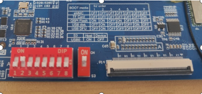

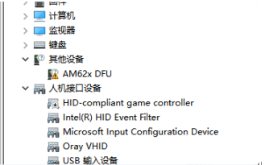


The screenshot of the driver installation is as follows:

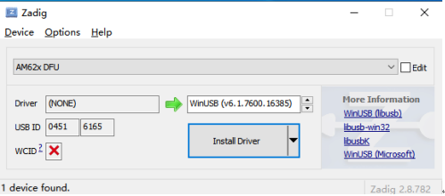

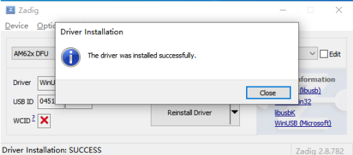

At this time, the device can be recognized:


Note: If there is a virtual machine, a USB connection selection interface will appear. Select “Remember my selection” to make it default to connect to the PC, as shown in the following figure. Otherwise, the flashing process may be interrupted.

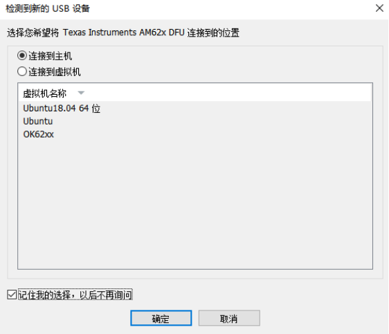

2\. Prepare the flashing files. Place the U - boot and file system to be flashed in the current directory, as shown in the red box in the following figure. 

The U - boot files include: tiboot3.bin, tispl.bin, u - boot.img. (Compiled from the U - boot in the SDK or a full compilation. After compilation, they are located in the “images/” folder.) 

The file system: rootfs.img (Compiled from the DFU in the SDK, located in the “images/ok62xx\_dfu/” folder.)

If you need to update the kernel or device tree, compile the Linux kernel. At this time, the compiled files will be automatically installed into the file system. Then compile the DFU packaged file system, copy it to Windows, and then flash it to complete the update.

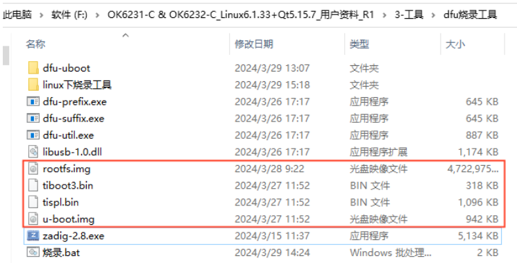

**Note: The dfu - U - boot folder in the flashing tool stores the U - boot that starts in DFU mode. If you need to replace it, put the tiboot3.bin, tispl.bin, and tispl.bin from “images/ok62xx\_dfu/” into it.**

3\. Double - click “Flash.bat” to start flashing, which will flash both the U - boot and the file system to the eMMC. As shown in the following figure, during the flashing process, the PC shell interface and the development board serial port will continuously print information. You can see the current flashing progress on the shell interface, and the serial port will continuously output “#”, indicating that the flashing is in progress.

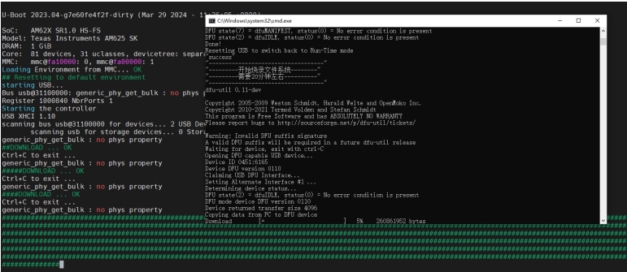

4\. When the flashing is completed, it will be shown as in the following figure. At this time, turn off the power. Set the OK62xx DIP switch to the emmc boot mode, which will boot the system from the emmc when powered on again.


### 6.3 USB DISK Flashing and Usage

#### 6.3.1 Making USB DISK for Flashing

The OK62xx - C platform supports USB disk flashing. First, you need to make a USB disk for flashing. Please use a USB disk with a capacity of 8G to 32G for flashing.

**Note: USB disk flashing only works for some USB disks and has a capacity limit (8G - 32G).**

The TI official errata sheet indicates that during the ROM stage, finding the USB disk may fail due to timing deviations, and there is no solution.

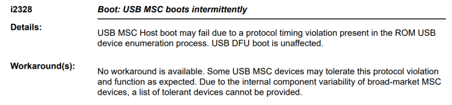

When the USB disk cannot be recognized, it is manifested as no printing log during USB disk flashing startup.

The following table shows the USB flash drives or adapter solutions that Forlinx has tested and can be used for flashing.

|   Brand/Adapter Solution   |        Model        |                           Picture                            |
| :------------------------: | :-----------------: | :----------------------------------------------------------: |
|      **SanDisk 32G**       | **CZ73/CZ74/CZ50**  | <br/>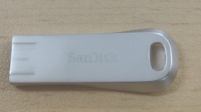<br/>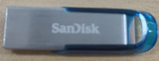 |
|   **S A M S U N G 32G**    |    **BAR Plus**     | 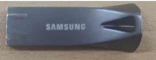 |
| **Card reader to SD card** | **SanDisk 16G/18G** |  |
| **Card reader to TF card** |   **SanDisk 16G**   |                       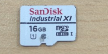                        |

Copy the Ok62xx-linux-sdk/tools/bin/mksdboot. sh to the/usr/bin directory in the PC virtual machine. Connect the USB disk to the PC virtual machine. After the virtual machine recognizes the USB flash disk, execute the mksdboot.sh to format the TF card according to the prompt content.

```plain
Availible Drives to write images to: 

#  major   minor    size   name 
1:   8       16    7761920 sdb

Enter Device Number: 1   //Input 1

sdb

sdb was selected

Checking the device is unmounted
unmounting device '/dev/sdb1'
Would you like to re-partition the drive anyways [y/n] : y     //Input y

Now partitioning sdb ...
```

2\. Copy all the files such as Image, ramdisk.img.gz, tiboot3.bin, tispl.bin, u-boot.img under the ok62xx\_msc folder, ok62xx-linux-fs.sdcard.a\*, and OK62xx-C.dtb in the directory \\2-Images and Source Codes\\0-Image Files\\images\_hsfs\_xg in the OK62xx-C (linux) user data to the USB flash drive.

The above images can also be replaced with the images with the same names compiled by yourself in the OK62xx-linux-sdk/images directory.

#### 6.3.2 USB DISK Flashing Test

1\. Set the DIP switch of OK62xx to the USB disk boot mode, connect the USB flash drive to USB0, and power on the device.

Switch S3 should be set to the “on” position. This switch has no effect during the U-boot stage, but the USB flash drive can only be detected and flashed during the kernel stage.

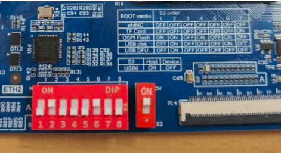

2\. Start flashing As shown in the log below, it indicates that the USB flash disk can be flashed. When a USB flash disk is inserted, the ramdisk. img. gz and the kernel image in the USB flash disk are loaded by default, and the USB flash disk is started through a virtual file system. After ramdisk has finished booting, it will automatically flash the filesystem ok-ok62xx-linux-fs.sdcard.a\* to emmc.

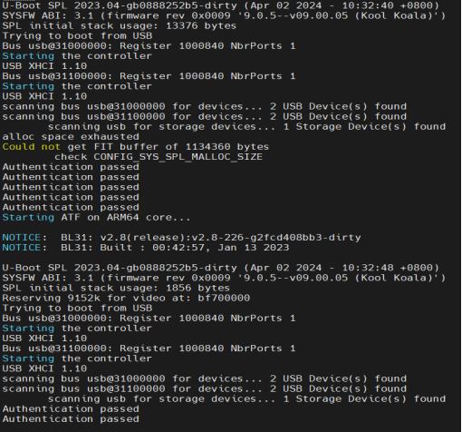

The log as shown in the figure below pops up, indicating that the capacity of the USB flash disk or startup media is too large. Please use a USB flash disk with a smaller capacity to flash.

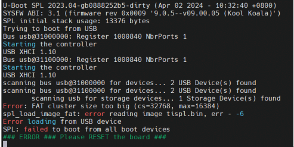

3\. During the flashing process, the SoM's indicator light will change from a heartbeat to a constant on state. After the flashing is completed, the SoM's indicator light will revert to the heartbeat pattern.

When the flashing is completed, the following printout will be displayed.

```plain
[  201.774542]  mmcblk0: p1 p2
[  202.786803]  mmcblk0: p1 p2
[Done] 199s
```


4\. Turn off the power and pull out the U disk. Set the OK62xx DIP switch to the emmc boot mode, which will boot the system from the emmc when powered on again.


